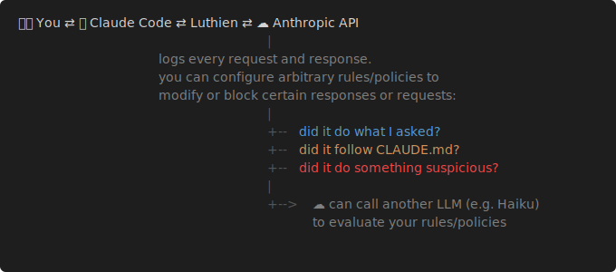

# Luthien
### Let AI code. Stay in control.

[What is it?](#what-is-it) | [What does it look like?](#what-does-it-look-like) | [How does it work?](#how-does-it-work) | [What can it do?](#what-can-it-do) | [Quick start](#quick-start)

---

## What is it?

Luthien is a proxy that sits between Claude Code (client) and the Claude API backend. It logs every request and response and enables you to set arbitrary rules/policies that can block dangerous operations, confirm the output is what you asked for, adheres to your CLAUDE.md, and doesn't contain suspicious stuff — all without changing your dev setup.

---

## What does it look like?

<table>
<tr>
<th width="50%">Before</th>
<th width="50%">After</th>
</tr>
<tr>
<td>


</td>
<td>


</td>
</tr>
</table>

> ⚠️ Luthien is in active development. [Star this repo](https://github.com/LuthienResearch/luthien-proxy) to follow updates, or [Watch > Releases](https://github.com/LuthienResearch/luthien-proxy/subscription) to get notified on new versions.
>
> Found a bug or have a question? [Open an issue](https://github.com/LuthienResearch/luthien-proxy/issues).

---

## How does it work?



Luthien runs on your machine or your cloud account.

---

## What can it do?

- **Block dangerous operations:** `rm -rf`, `git push --force`, dropping database tables
- **Enforce package standards:** block `pip install`, suggest `uv add` instead
- **Clean up AI writing tics:** remove em dashes, curly quotes, over-bulleting
- **Enforce scope boundaries:** only allow changes to files mentioned in the request
- **Log everything:** get a URL to a live-updating log of your full agent conversation

<details>
<summary><b>Example: PipBlockPolicy (click to expand)</b></summary>

```python
class PipBlockPolicy(SimpleJudgePolicy):
    RULES = [
        "Block any 'pip install' or 'pip3 install' commands. Suggest 'uv add' instead.",
        "Block 'python -m pip install' commands.",
        "Allow all other tool calls.",
    ]
```

</details>

Every policy action is logged. Measure what got blocked, track false positives, monitor latency overhead.

---

## Quick Start

**Prerequisites:**
[Docker](https://www.docker.com/products/docker-desktop/) must be running (or `brew install --cask docker`).
Install [uv](https://docs.astral.sh/uv/) if you haven't: `curl -LsSf https://astral.sh/uv/install.sh | sh`

### 1. Clone the repo

```bash
git clone https://github.com/LuthienResearch/luthien-proxy && cd luthien-proxy
```

### 2. Add your Anthropic API key to `.env`

```bash
cp .env.example .env && echo "ANTHROPIC_API_KEY=your-key-here" >> .env
```

Replace `your-key-here` with your key from [console.anthropic.com](https://console.anthropic.com/settings/keys).

### 3. Run quick start script

```bash
./scripts/quick_start.sh
```

### 4. Launch Claude Code through the proxy

```bash
./scripts/launch_claude_code.sh
```

🚀🎉 All requests and responses are now logged through the proxy.


### 5. See conversation history and raw logs

See your conversation history: <http://localhost:8000/history>

Or see full JSONLs in the activity monitor: <http://localhost:8000/activity/monitor>

### 6. Set up a DeSlop policy (string replacement)

| Find | Replace with |
|------|-------------|
| `—` (em dash) | `-` (hyphen) |

Runs on every LLM response. Switch policies at [localhost:8000/policy-config](http://localhost:8000/policy-config).

<details>
<summary><b>See the code (click to expand)</b></summary>

```python
from luthien_proxy.policies.simple_policy import SimplePolicy

class DeSlop(SimplePolicy):
    async def simple_on_response_content(self, content, ctx):  # runs on every LLM response before it reaches Claude Code
        return content.replace("\u2014", "-").replace("\u2013", "-")  # em dash → hyphen, en dash → hyphen
```

</details>

### 7. Set up an LLM-as-judge policy

Luthien can call an LLM (like Haiku) to evaluate your rules on every request and response.

<details>
<summary><b>Did it do what I asked?</b></summary>

```python
from luthien_proxy.policies.simple_judge_policy import SimpleJudgePolicy

class PromptCompliance(SimpleJudgePolicy):  # sends the conversation to Haiku after each response
    RULES = [
        "Check if the agent actually completed what the user asked for.",
        "Flag if it claimed 'Done!' but left TODOs, stubs, or placeholder code.",
        "Flag if it deleted or commented out tests instead of fixing them.",
    ]
    # results logged to activity monitor: http://localhost:8000/activity/monitor
```

</details>

<details>
<summary><b>Did it follow CLAUDE.md?</b></summary>

```python
from luthien_proxy.policies.simple_judge_policy import SimpleJudgePolicy

class RuleEnforcement(SimpleJudgePolicy):  # reads your CLAUDE.md and checks compliance
    RULES = [
        "Block any 'pip install' commands. Suggest 'uv add' instead.",  # from CLAUDE.md: "use uv, not pip"
        "Flag if agent removed comments or log lines without being asked.",
        "Flag if agent ignored rules that were explicitly stated in CLAUDE.md.",
    ]
```

</details>

<details>
<summary><b>Did it do something suspicious?</b></summary>

```python
from luthien_proxy.policies.simple_judge_policy import SimpleJudgePolicy

class SafetyGuard(SimpleJudgePolicy):  # intercepts tool calls and checks them before they execute
    RULES = [
        "Block 'rm -rf' or any recursive delete on project directories.",
        "Block 'git push --force' to main or master.",
        "Flag if agent wraps code in try/except that swallows all errors.",
        "Flag if agent pip-installs packages not in requirements.",
    ]
```

</details>

---

## What You Get

- **Gateway** (OpenAI/Anthropic-compatible) at <http://localhost:8000>
- **PostgreSQL** and **Redis** fully configured
- **Real-time monitoring** at <http://localhost:8000/activity/monitor>
- **Policy management UI** at <http://localhost:8000/policy-config>

## Configuration

Copy `.env.example` to `.env`. The required settings are:

```bash
ANTHROPIC_API_KEY=your_key_here       # Required: upstream API key
PROXY_API_KEY=sk-luthien-dev-key      # Clients use this to access the proxy
ADMIN_API_KEY=admin-dev-key           # For admin/policy management UI
```

See [`.env.example`](.env.example) for all options (database, Redis, observability, judge policies).

## Endpoints

| Endpoint | Description |
|----------|-------------|
| `POST /v1/chat/completions` | OpenAI Chat Completions API |
| `POST /v1/messages` | Anthropic Messages API |
| `GET /health` | Health check |
| `GET /activity/monitor` | Real-time activity monitor |
| `GET /policy-config` | Policy management UI |
| `GET /admin/policy/*` | Admin API ([details](dev/README.md)) |

All API requests require `Authorization: Bearer <PROXY_API_KEY>`.

## Development

```bash
./scripts/dev_checks.sh              # Format + lint + tests + type check
uv run pytest tests/unit_tests       # Quick unit tests
docker compose restart gateway       # Restart after code changes
```

For architecture, observability, and contributor docs, see **[dev/README.md](dev/README.md)**.

## Troubleshooting

```bash
docker compose ps                    # Check service status
docker compose logs -f gateway       # View gateway logs
docker compose down && ./scripts/quick_start.sh  # Full restart
```

1. **Gateway not starting?** Check `docker compose logs gateway`
2. **API requests failing?** Verify `PROXY_API_KEY` header and upstream API keys in `.env`
3. **Database issues?** `docker compose restart db`

## License

Apache License 2.0
