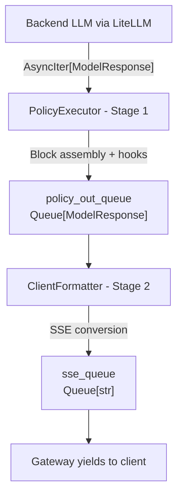

# Request Processing & Streaming Pipeline Architecture

**Last Updated**: 2025-11-05

This document provides a comprehensive overview of how requests flow through the V2 gateway, from initial validation through response delivery. It covers the complete request/response lifecycle, including non-streaming completions and the streaming pipeline architecture.

---

## Conceptual Overview

The V2 gateway processes LLM requests through a unified request/response lifecycle orchestrated by `PolicyOrchestrator`:

1. **Request Phase**: Client request arrives, contexts are created, policy hooks are invoked to validate/modify the request
2. **Backend Phase**: Request is forwarded to the LLM backend (via LiteLLM) and the backend produces a response
3. **Response Phase**: Response is processed through policy hooks and returned to the client

The critical difference between streaming and non-streaming is **when** the response arrives:

- **Non-streaming**: Backend returns complete response immediately → process all at once
- **Streaming**: Backend returns response incrementally as chunks → process each chunk through a pipeline

Both paths use the same request hooks and context threading. Only the response handling differs.

---

## Non-Streaming Pipeline

**The Journey of a Simple Chat Completion**:

### 1. Client sends request

Request arrives at `/v1/chat/completions` (OpenAI format) or `/v1/messages` (Anthropic format)

### 2. Gateway receives request

([gateway_routes.py](../src/luthien_proxy/v2/gateway_routes.py))

- Creates `ObservabilityContext` (trace spans, metrics)
- Creates `PolicyContext` (transaction_id, scratchpad for policy state)
- Validates authentication (API key check)

### 3. Request processing

Via `PolicyOrchestrator.process_request()`

- Policy hook: `on_request_started(request, policy_ctx, obs_ctx)`
- Policy can modify request, add metadata, or reject
- Policy hook: `on_request_completed(modified_request, policy_ctx, obs_ctx)`

### 4. LiteLLM forwards to backend

- Request sent to configured LLM (OpenAI, Anthropic, local Ollama, etc.)
- LiteLLM handles format conversion between providers
- Backend returns complete response

### 5. Response processing

**Note**: Currently invokes policy directly via `policy.process_full_response()` (should be refactored to use `PolicyOrchestrator.process_nonstreaming_response()` for consistency with streaming path and proper logging of original vs final response)

- Policy processes complete response (hooks TBD)
- Policy can inspect, modify, or reject response

### 6. Response returned to client

- Format converted to client's expected format (OpenAI or Anthropic)
- Events recorded to database (`conversation_calls`, `conversation_events`)
- Published to Redis for activity monitoring

**Total time**: ~1-5 seconds depending on LLM latency

---

## Streaming Pipeline

The streaming pipeline handles requests where the backend returns response chunks incrementally. The request phase is identical to non-streaming; the response handling differs.

### How Streaming Differs from Non-Streaming

Instead of receiving a complete response at once, the backend returns an `AsyncIterator[ModelResponse]`. This requires a two-stage processing pipeline:

1. **Stage 1 (PolicyExecutor)**: Consume raw chunks from backend, assemble complete blocks, invoke policy hooks, put processed chunks in `policy_out_queue`
2. **Stage 2 (ClientFormatter)**: Consume processed chunks from `policy_out_queue`, convert to client format (SSE), put strings in `sse_queue`
3. **Stage 3 (Gateway)**: Drain `sse_queue` and yield to client

This approach gives policies visibility into complete blocks (not just raw chunks) while maintaining streaming semantics to the client.

### Quick Reference Diagram



**Key Components**:

- **PolicyExecutor**: Assembles blocks from chunks, invokes policy hooks (55 unit tests)
- **ClientFormatter**: Converts ModelResponse → SSE strings (12 unit tests)
- **Queues**: Bounded (maxsize=10000) with 30s timeout on put operations

### Detailed Flow

**The Journey of a Streaming Chat Completion**:

### 1. Client sends streaming request

Request includes `"stream": true`

### 2. Gateway receives request

(Same as non-streaming)

- Creates contexts (`ObservabilityContext`, `PolicyContext`)
- Validates authentication
- Processes request through policy hooks

### 3. LiteLLM streams from backend

- Returns `AsyncIterator[ModelResponse]` - chunks arrive incrementally
- LiteLLM already normalized chunks to common format
- **Key insight**: No ingress formatting needed!

### 4. Streaming Pipeline - Stage 1: PolicyExecutor

- Consumes `AsyncIterator[ModelResponse]` from backend
- **Block Assembly**: Uses `StreamingChunkAssembler` to build complete blocks
  - Detects when content blocks complete
  - Detects when tool calls complete
  - Tracks finish_reason
- **Policy Hooks**: Invokes policy at key moments
  - `on_content_delta(delta, ...)` - each content chunk
  - `on_tool_call_delta(delta, ...)` - each tool call chunk
  - `on_block_complete(block, ...)` - when block finishes
  - `on_stream_complete(...)` - when stream ends
- **Timeout Monitoring**: Calls `keepalive()` on each chunk to prevent hangs
- **Outputs**: Puts processed `ModelResponse` chunks into `policy_out_queue`

### 5. Queue Handoff: policy_out_queue

- Typed as `Queue[ModelResponse]`
- Bounded queue (maxsize=10000)
- 30s timeout on put() to prevent deadlock

### 6. Streaming Pipeline - Stage 2: ClientFormatter

- Consumes `ModelResponse` chunks from `policy_out_queue`
- **OpenAI Client**: Converts to OpenAI SSE format
  - `data: {"id": "...", "choices": [{"delta": {...}}]}\n\n`
- **Anthropic Client**: Converts to Anthropic SSE format with event lifecycle
  - `event: message_start\ndata: {...}\n\n`
  - `event: content_block_delta\ndata: {...}\n\n`
  - `event: message_stop\ndata: {...}\n\n`
- **Outputs**: Puts SSE strings into `sse_queue`

### 7. Queue Handoff: sse_queue

- Typed as `Queue[str]`
- Bounded queue (maxsize=10000)
- 30s timeout on put()

### 8. Gateway yields to client

- Drains `sse_queue` with `async for sse_string in ...: yield sse_string`
- Client receives Server-Sent Events incrementally
- Events recorded and published (same as non-streaming)

**Total time**: Streaming duration + policy overhead (typically milliseconds per chunk)

---

## Key Design Principles

### 1. Dependency Injection

Gateway creates pipeline components and injects them:

```python
# In gateway_routes.py
policy_executor = DefaultPolicyExecutor(timeout_seconds=30.0)
client_formatter = AnthropicClientFormatter(model_name=request.model)

orchestrator = PolicyOrchestrator(
    policy=policy,
    policy_executor=policy_executor,
    client_formatter=client_formatter,
    transaction_recorder=transaction_recorder,
)
```

**Why**: Clear dependencies, easy to test, explicit over implicit.

### 2. Context Threading

`ObservabilityContext` and `PolicyContext` created at gateway, passed through entire lifecycle:

```python
# Created once
obs_ctx = ObservabilityContext(trace_id=..., span=...)
policy_ctx = PolicyContext(transaction_id=call_id)

# Threaded through all operations
orchestrator.process_request(request, obs_ctx, policy_ctx)
orchestrator.process_streaming_response(stream, obs_ctx, policy_ctx)
```

**Why**: Consistent tracing, no globals, clear lifecycle ownership.

### 3. Typed Queues

Explicit types at queue boundaries catch errors early:

```python
policy_out_queue: asyncio.Queue[ModelResponse] = asyncio.Queue(maxsize=10000)
sse_queue: asyncio.Queue[str] = asyncio.Queue(maxsize=10000)
```

**Why**: Type safety, clear contracts, self-documenting code.

### 4. Bounded Queues with Circuit Breaker

Large but bounded queues prevent memory exhaustion:

- maxsize=10000 (handles bursts)
- 30s timeout on put() (prevents deadlock)
- Raises `QueueFullError` if overwhelmed

**Why**: Fail fast under load rather than OOM.

### 5. Separation of Concerns

- **PolicyExecutor**: Stream mechanics (chunking, timeout, assembly)
- **Policy**: Business logic (allow/block decisions, transformations)
- **ClientFormatter**: Output format conversion
- **PolicyOrchestrator**: Coordinates pipeline, doesn't implement logic

**Why**: Each component has single responsibility, easy to test and maintain.

---

## Policy Hook Points

Policies can intercept at these points:

### Request Lifecycle

- `on_request_started(request, policy_ctx, obs_ctx)` - Before LLM call
- `on_request_completed(request, policy_ctx, obs_ctx)` - After modification

### Streaming Response Lifecycle

- `on_response_started(policy_ctx, obs_ctx)` - Stream begins
- `on_content_delta(delta, policy_ctx, obs_ctx)` - Each content chunk
- `on_tool_call_delta(delta, policy_ctx, obs_ctx)` - Each tool call chunk
- `on_block_complete(block, policy_ctx, obs_ctx)` - Block finished
- `on_stream_complete(policy_ctx, obs_ctx)` - Stream finished

### Non-Streaming Response Lifecycle

**Status**: Not yet fully integrated with orchestrator

- `process_full_response(response, policy_ctx)` - Process complete response (currently the only hook)

**Example Policy**: ToolCallJudgePolicy buffers tool calls, sends them to judge LLM, blocks if unsafe.

---

## Component Locations

### Core Pipeline

- **Gateway Routes**: `src/luthien_proxy/v2/gateway_routes.py`
- **PolicyOrchestrator**: `src/luthien_proxy/v2/orchestration/policy_orchestrator.py`
- **PolicyExecutor**: `src/luthien_proxy/v2/streaming/policy_executor/default.py`
- **ClientFormatter**: `src/luthien_proxy/v2/streaming/client_formatter/{openai,anthropic}.py`

### Supporting Components

- **StreamingChunkAssembler**: `src/luthien_proxy/v2/streaming/streaming_chunk_assembler.py`
- **PolicyContext**: `src/luthien_proxy/v2/policies/policy_context.py`
- **ObservabilityContext**: `src/luthien_proxy/v2/observability/context.py`
- **TransactionRecorder**: `src/luthien_proxy/v2/observability/transaction_recorder.py`

### Policies

- **Policy Protocol**: `src/luthien_proxy/v2/policies/policy.py`
- **Example Policies**: `src/luthien_proxy/v2/policies/{noop,simple,debug_logging,tool_call_judge}_policy.py`

### Tests

- **PolicyExecutor tests**: `tests/unit_tests/v2/streaming/policy_executor/` (55 tests)
- **ClientFormatter tests**: `tests/unit_tests/v2/streaming/client_formatter/` (12 tests)
- **E2E tests**: `tests/e2e_tests/test_v2_api_compatibility.py`

---

## Common Questions

### Q: Why not just use callbacks like before?

**A**: Explicit queues make data flow visible, enable recording at boundaries, and make testing easier. Can inspect queue states during debugging.

### Q: Why remove CommonFormatter?

**A**: Discovered LiteLLM already normalizes backend responses to ModelResponse. Having a formatter that did `ModelResponse → ModelResponse` was unnecessary complexity (~200 lines removed).

### Q: What if a policy is slow?

**A**: Bounded queues prevent unbounded memory growth. If `policy_out_queue` fills up, the system fails fast with `QueueFullError` rather than consuming all memory.

### Q: How does timeout monitoring work?

**A**: PolicyExecutor calls `self.keepalive()` on each chunk. If no chunks arrive for 30s, timeout triggers. This prevents hanging on slow/stuck LLM connections.

### Q: Can policies modify streaming chunks?

**A**: Yes! Policies can inject new chunks, block chunks, or transform them. For example, ToolCallJudgePolicy blocks tool calls by injecting error content chunks.

### Q: How do I add a new policy?

**A**: Implement `PolicyProtocol` with your hook logic. See `dev/event_driven_policy_guide.md` for examples. NoOpPolicy is the simplest reference implementation.

---

## Performance Characteristics

### Latency Overhead

- **Non-streaming**: ~1-5ms (policy hook invocations)
- **Streaming**: ~1-2ms per chunk (assembly + policy hooks)
- **Queue operations**: Sub-millisecond (asyncio queues are fast)

### Memory Usage

- **Bounded queues**: Max 10000 items per queue
- **ModelResponse size**: ~1-5KB per chunk typically
- **Worst case**: ~50MB per active stream (policy_out_queue + sse_queue full)

### Throughput

- **Concurrent streams**: Limited by asyncio TaskGroup overhead (minimal)
- **Bottleneck**: Usually backend LLM latency, not proxy
- **Queue saturation**: Needs sustained 300+ chunks/sec to fill queues

---

## Troubleshooting

### Streaming hangs

- Check PolicyExecutor timeout (default 30s)
- Look for policy hooks that don't complete
- Verify backend LLM is actually streaming

### Queue full errors

- Policy is too slow (buffering/judging taking too long)
- Backend producing chunks faster than client consuming
- Consider increasing queue size or optimizing policy

### Missing chunks in output

- Policy may not be forwarding chunks (check `on_content_delta` implementation)
- ClientFormatter may have bug (check unit tests)
- Verify chunks in `policy_out_queue` before formatter

### Type errors

- Ensure using proper LiteLLM types (`StreamingChoices`, `Delta`, not dicts)
- Check queue type annotations match what's being put/get
- Use test fixtures as reference for proper types

---

## Related Documentation

- **Context Files**:
  - [codebase_learnings.md](context/codebase_learnings.md#streaming-pipeline-architecture-2025-11-05) - Architecture patterns
  - [decisions.md](context/decisions.md#streaming-pipeline-queue-based-architecture-2025-11-05) - Why this approach
  - [gotchas.md](context/gotchas.md#queue-shutdown-for-stream-termination-2025-01-20-updated-2025-10-20) - Queue patterns

- **Implementation Details**:
  - [success.md](success.md#2025-11-05-streaming-pipeline-refactor-complete) - Refactor accomplishments
  - Event-driven policy guide (if exists) - How to write policies

- **Observability**:
  - [observability-v2.md](observability-v2.md) - Tracing and monitoring
  - [VIEWING_TRACES_GUIDE.md](VIEWING_TRACES_GUIDE.md) - Using Grafana

- **Archive** (historical context):
  - [archive/streaming-refactor-2025-11-05/](archive/streaming-refactor-2025-11-05/) - Completed objective and design docs
