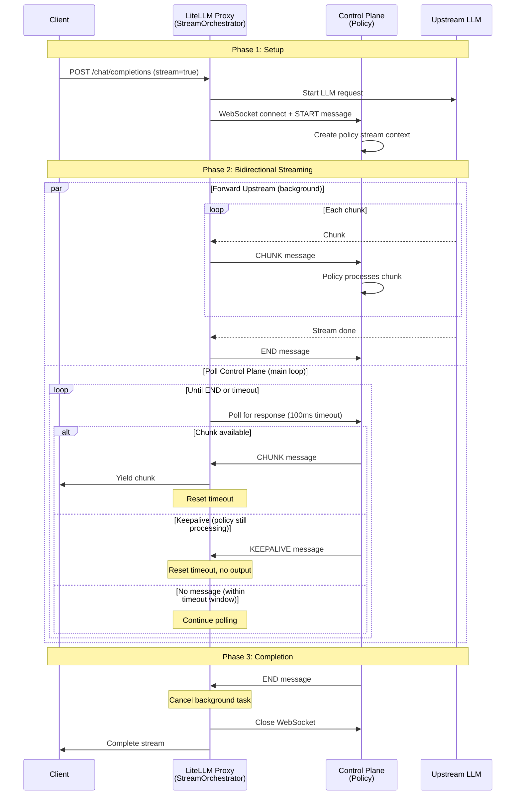
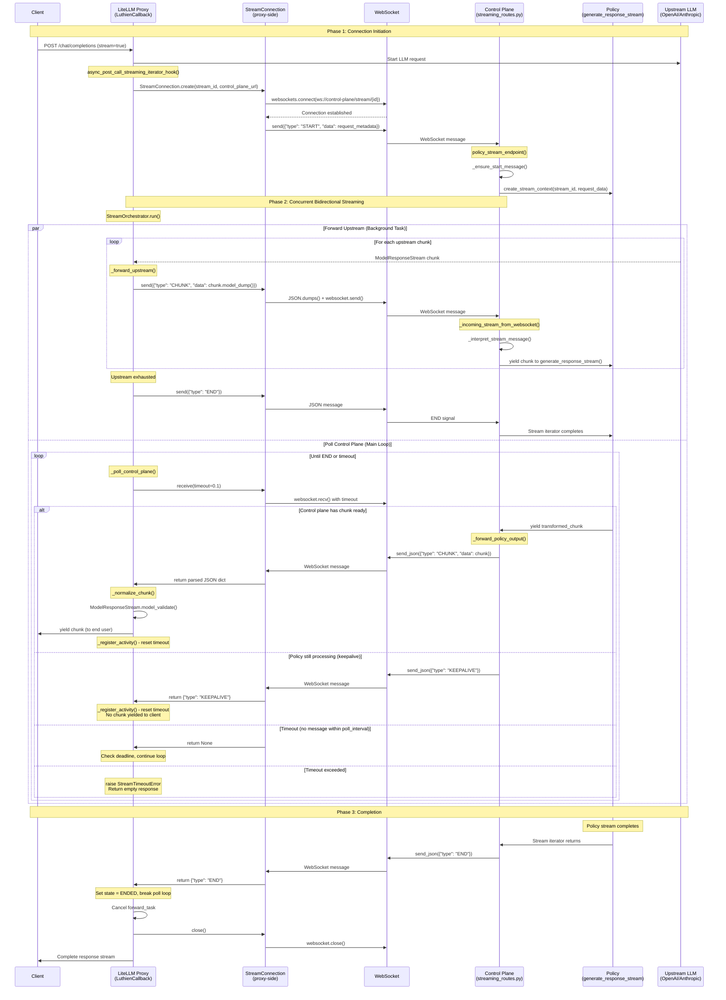

# Streaming Architecture Documentation

**Status**: Legacy (current architecutre is significantly different)
**Last Updated**: 2025-10-06
**Related Files**:
- `config/litellm_callback.py`
- `src/luthien_proxy/proxy/stream_connection_manager.py`
- `src/luthien_proxy/proxy/stream_orchestrator.py`
- `src/luthien_proxy/control_plane/streaming_routes.py`

## Overview

The streaming architecture implements bidirectional communication between the LiteLLM proxy and the control plane over WebSocket, allowing policies to inspect and transform streaming LLM responses in real-time.

**Key Principle**: The control plane is the canonical source of responses. The client receives ONLY what the control plane explicitly sends (deny-by-default).

## Architecture Diagram



## Detailed Architecture Diagram

For implementation details, see the expanded diagram below:

<details>
<summary>Expanded Sequence Diagram (click to expand)</summary>



</details>

## Key Components

### Proxy Side (LiteLLM)

#### `LuthienCallback.async_post_call_streaming_iterator_hook()`
**Location**: `config/litellm_callback.py:238`

Main entry point for streaming requests. Responsibilities:
1. Extract `stream_id` from request
2. Create WebSocket connection to control plane
3. Send START message with request metadata
4. Create and run `StreamOrchestrator`
5. Yield transformed chunks to client
6. Clean up connection on completion/error

```python
async def async_post_call_streaming_iterator_hook(
    self,
    user_api_key_dict: Any,
    response: AsyncGenerator[ModelResponseStream, None],
    request_data: dict[str, Any],
) -> AsyncGenerator[ModelResponseStream, None]:
    stream_id = request_data.get("litellm_call_id")

    # Open connection
    connection = await StreamConnection.create(
        stream_id=stream_id,
        control_plane_url=self.control_plane_url,
    )
    await connection.send({"type": "START", "data": sanitized_request})

    # Run orchestrator
    orchestrator = StreamOrchestrator(
        stream_id=stream_id,
        connection=connection,
        upstream=response,
        normalize_chunk=self._normalize_stream_chunk,
        timeout=self.stream_timeout,
    )

    async for transformed in orchestrator.run():
        yield transformed
```

#### `StreamConnection`
**Location**: `src/luthien_proxy/proxy/stream_connection_manager.py`

Thin wrapper around WebSocket for JSON message exchange.

**Methods**:
- `create(stream_id, control_plane_url)` - Class method to establish WebSocket connection
- `send(message: dict)` - Send JSON message to control plane
- `receive(timeout: float | None)` - Receive JSON message (returns `None` on timeout)
- `close()` - Close WebSocket connection

**Design**: Direct WebSocket calls (no queues, no background tasks). Simple and synchronous.

#### `StreamOrchestrator`
**Location**: `src/luthien_proxy/proxy/stream_orchestrator.py`

Manages bidirectional streaming between upstream LLM and control plane.

**Key Methods**:

1. **`run()`** - Main orchestration loop
   - Launches `_forward_upstream()` as background task
   - Polls control plane via `_poll_control_plane()`
   - Yields chunks to client
   - Cancels background task on completion

2. **`_forward_upstream()`** - Background task
   - Iterates over upstream LLM response
   - Sends each chunk to control plane: `connection.send({"type": "CHUNK", "data": chunk.model_dump()})`
   - Sends END when upstream exhausted
   - Closes upstream generator on completion

3. **`_poll_control_plane()`** - Main polling loop
   - Calls `connection.receive(timeout=poll_interval)` in loop
   - Processes control plane messages:
     - `CHUNK` → normalize and yield to client, reset timeout
     - `KEEPALIVE` → reset timeout, no yield
     - `END` → set state to ENDED, break loop
     - `ERROR` → raise exception
   - Enforces activity timeout (default 30s)
   - Raises `StreamTimeoutError` if no activity within timeout window

**State Machine**:
- `ACTIVE` - Normal streaming
- `ENDED` - Received END from control plane
- `FAILED` - Error or timeout occurred

**Timeout Behavior**:
- Activity-based, not total duration
- Resets on CHUNK or KEEPALIVE
- Only fires if NO activity for `timeout` seconds

### Control Plane Side

#### `policy_stream_endpoint()`
**Location**: `src/luthien_proxy/control_plane/streaming_routes.py:355`

WebSocket endpoint that coordinates streaming requests.

**Flow**:
1. Accept WebSocket connection
2. Await START message: `_ensure_start_message()`
3. Create policy stream context: `policy.create_stream_context()`
4. Create incoming stream: `_incoming_stream_from_websocket()`
5. Forward policy output: `_forward_policy_output()`
6. Send END message
7. Close WebSocket

#### `_incoming_stream_from_websocket()`
**Location**: `src/luthien_proxy/control_plane/streaming_routes.py:62`

Converts WebSocket messages into async iterator of chunks.

```python
async def _incoming_stream_from_websocket(
    websocket: WebSocket,
    stream_id: str,
    on_chunk=None,
) -> AsyncIterator[dict[str, Any]]:
    while True:
        message = await websocket.receive_json()
        outcome = _interpret_stream_message(stream_id, message)
        if outcome == STREAM_END:
            break
        if outcome is not None:
            yield outcome
```

#### `_forward_policy_output()`
**Location**: `src/luthien_proxy/control_plane/streaming_routes.py:115`

Consumes policy's output stream and sends chunks back over WebSocket.

```python
async def _forward_policy_output(
    websocket: WebSocket,
    policy: LuthienPolicy,
    context: StreamPolicyContext,
    incoming_stream: AsyncIterator[dict[str, Any]],
    on_chunk=None,
) -> None:
    async for outgoing_chunk in policy.generate_response_stream(context, instrumented_incoming):
        await websocket.send_json({"type": "CHUNK", "data": outgoing_chunk})
```

#### Policy's `generate_response_stream()`
**Location**: Implemented by each policy (e.g., `policies/noop.py`, `policies/tool_call_judge.py`)

Policy-specific streaming logic. Receives upstream chunks, applies transformations/filtering, yields output chunks.

**Examples**:

**NoOp Policy** - Pass through unchanged:
```python
async def generate_response_stream(
    self,
    context: StreamPolicyContext,
    incoming_stream: AsyncIterator[dict]
) -> AsyncIterator[dict]:
    async for chunk in incoming_stream:
        yield chunk
```

**Judge Policy** - Buffer until tool call, evaluate, block or allow:
```python
async def generate_response_stream(
    self,
    context: StreamPolicyContext,
    incoming_stream: AsyncIterator[dict],
) -> AsyncIterator[dict]:
    buffer = []
    async for chunk in incoming_stream:
        buffer.append(chunk)
        if self._has_tool_call(chunk):
            # Judge evaluation happens here
            if await self._should_block(buffer):
                yield self._blocked_message()
            else:
                for buffered in buffer:
                    yield buffered
            return
    # No tool call, pass through
    for buffered in buffer:
        yield buffered
```

## Message Protocol

All messages are JSON objects with a `type` field.

### Proxy → Control Plane

| Type | Data | Description |
|------|------|-------------|
| `START` | `{request metadata}` | Initiate stream with request context |
| `CHUNK` | `{chunk: ModelResponseStream.model_dump()}` | Upstream LLM chunk |
| `END` | none | Upstream stream complete |

### Control Plane → Proxy

| Type | Data | Description |
|------|------|-------------|
| `CHUNK` | `{chunk: dict}` | Policy output chunk (sent to client) |
| `KEEPALIVE` | none | Heartbeat to prevent timeout (no client output) |
| `END` | none | Policy stream complete |
| `ERROR` | `{error: str}` | Policy encountered error |

## Error Handling

### Timeout
- **Trigger**: No CHUNK or KEEPALIVE received for `timeout` seconds (default 30s)
- **Behavior**: `StreamOrchestrator` raises `StreamTimeoutError`, callback returns empty response
- **Client sees**: Stream ends immediately with whatever chunks were already yielded

### Connection Failure
- **Trigger**: WebSocket connection lost/closed unexpectedly
- **Behavior**: `StreamConnectionError` raised, callback returns empty response
- **Client sees**: Stream ends immediately

### Protocol Violation
- **Trigger**: Invalid message format, missing START, etc.
- **Behavior**: `StreamProtocolError` raised
- **Client sees**: Stream ends immediately

### Policy Error
- **Trigger**: Exception in `policy.generate_response_stream()`
- **Behavior**: Control plane sends `{"type": "ERROR", "error": "..."}`, proxy raises exception
- **Client sees**: Stream ends immediately

**General Principle**: On any error, return empty response (deny-by-default). No fallback to passthrough mode.

## Keepalive Mechanism

**Purpose**: Allow policies to signal "I'm alive and processing" without sending content chunks.

**Use Case**: Policies that buffer the entire upstream before emitting (e.g., Judge policy waits for tool call completion, then evaluates for 5-10 seconds).

**Implementation**:
- Control plane sends `{"type": "KEEPALIVE"}` periodically (e.g., every 10s)
- Proxy's `_poll_control_plane()` receives KEEPALIVE, calls `_register_activity()`, continues loop
- No chunk yielded to client
- Timeout deadline resets

**Example** (in policy):
```python
async def generate_response_stream(self, context, incoming_stream):
    buffer = []
    last_keepalive = time.time()

    # Buffer all chunks (may take >30s)
    async for chunk in incoming_stream:
        buffer.append(chunk)

        # Send keepalive if available
        if context.keepalive and time.time() - last_keepalive > 10.0:
            await context.keepalive.send_keepalive()
            last_keepalive = time.time()

    # Heavy processing (may take >30s)
    result = await self._analyze(buffer)

    # Emit result
    for chunk in result:
        yield chunk
```

## Configuration

### Environment Variables

- `CONTROL_PLANE_URL` - Control plane base URL (default: `http://localhost:8081`)
- Stream timeout is currently hardcoded at 30s in `LuthienCallback` (TODO: make configurable)

### Configurable Parameters

In `StreamOrchestrator.__init__()`:
- `timeout` (float) - Activity timeout in seconds
- `poll_interval` (float) - How often to check for messages (default 0.1s)
- `clock` (callable) - Time source for testing (default `time.monotonic`)

## Design Decisions

### Why Direct WebSocket Calls (No Queues)?
The original design had queues + background sender/receiver tasks. We simplified to direct calls because:
1. **Decoupling already exists** - `StreamOrchestrator` has a background task for forwarding upstream
2. **Simpler is better** - Direct calls are easier to reason about and debug
3. **Performance** - One less layer of indirection and task scheduling
4. **Sufficient** - WebSocket library handles buffering internally

### Why Activity-Based Timeout (Not Total Duration)?
A streaming response might take 60+ seconds if:
- LLM is slow to respond
- Policy does heavy processing per chunk
- Long response with many chunks

We only want to timeout if the control plane is *unresponsive*, not if it's actively streaming.

Solution: Reset deadline on every CHUNK or KEEPALIVE.

### Why Deny-by-Default on Errors?
**Security**: If policy evaluation fails, we don't want potentially harmful content to leak through.

**Simplicity**: No complex fallback logic or partial state to manage.

**Clarity**: Client either gets approved content or nothing.

## Debugging & Instrumentation

The streaming pipeline includes comprehensive logging at every layer for debugging streaming issues.

### Available Logging Tools

#### 1. WebSocket Message Logger (Proxy Side)
**Location**: `src/luthien_proxy/proxy/websocket_logger.py`

Logs all messages sent and received over WebSocket connections between LiteLLM and the control plane.

**Usage**:
```python
from luthien_proxy.proxy.websocket_logger import get_websocket_logger, enable_websocket_logging

# Get the singleton logger
ws_logger = get_websocket_logger()

# Enable/disable logging
enable_websocket_logging()  # Enabled by default
disable_websocket_logging()
```

**Log Output**:
```
WebSocket OUT [stream-abc123]: type=START, keys=['type', 'data']
  START: model=gpt-4
WebSocket OUT [stream-abc123]: type=CHUNK, keys=['type', 'data']
  CHUNK: id=chatcmpl-123
WebSocket IN  [stream-abc123]: type=CHUNK, keys=['type', 'data']
  CHUNK: content='Hello'
WebSocket IN  [stream-abc123]: type=END, keys=['type']
```

**What it logs**:
- **Outgoing** (Proxy → Control Plane): START, CHUNK, END messages
- **Incoming** (Control Plane → Proxy): CHUNK, KEEPALIVE, END, ERROR messages
- Message type, stream ID, and key structure
- Additional details (model, chunk ID, content preview)

#### 2. Callback Chunk Logger (Proxy Side)
**Location**: `src/luthien_proxy/proxy/callback_chunk_logger.py`

Logs chunk processing in the LiteLLM callback layer: chunks received from control plane, normalization, and yielding to client.

**Usage**:
```python
from luthien_proxy.proxy.callback_chunk_logger import get_callback_chunk_logger

# Get the singleton logger
chunk_logger = get_callback_chunk_logger()
```

**Log Output**:
```
CALLBACK CONTROL IN  [stream-abc123] #0: type=CHUNK
CALLBACK NORMALIZED  [stream-abc123]: success=True, model=gpt-4
CALLBACK TO CLIENT   [stream-abc123] #0: content='Hello'
```

**What it logs**:
- Messages received from control plane in `_poll_control_plane()`
- Chunk normalization (success/failure with validation errors)
- Chunks yielded to client with index and content preview

#### 3. Streaming Endpoint Logger (Control Plane Side)
**Location**: `src/luthien_proxy/control_plane/endpoint_logger.py`

Logs WebSocket endpoint handling: START messages, incoming/outgoing chunks, policy invocations.

**Usage**:
```python
from luthien_proxy.control_plane.endpoint_logger import get_endpoint_logger

# Get the singleton logger
endpoint_logger = get_endpoint_logger()
```

**Log Output**:
```
ENDPOINT START [stream-abc123]: call_id=abc123, model=gpt-4, stream=True
ENDPOINT CHUNK IN [stream-abc123] #0: content='Hello'
ENDPOINT POLICY INVOKE [stream-abc123]: policy=NoOpPolicy
ENDPOINT CHUNK OUT [stream-abc123] #0: content='Hello'
ENDPOINT END [stream-abc123]
```

**What it logs**:
- START message with request metadata
- Incoming chunks from LiteLLM (upstream output)
- Policy invocations
- Outgoing chunks to LiteLLM (policy output)
- END/ERROR messages

#### 4. Policy Stream Logger (Control Plane Side)
**Location**: `src/luthien_proxy/policies/policy_instrumentation.py`

Logs policy-level streaming: chunks in, chunks out, stream lifecycle.

**Usage**:
```python
from luthien_proxy.policies.policy_instrumentation import get_policy_logger

# Get the singleton logger
policy_logger = get_policy_logger()
```

**Log Output**:
```
POLICY STREAM START [stream-abc123]: policy=NoOpPolicy
POLICY CHUNK IN  [stream-abc123:NoOpPolicy] #0: delta='Hello'
POLICY CHUNK OUT [stream-abc123:NoOpPolicy] #0: delta='Hello'
POLICY STREAM END [stream-abc123:NoOpPolicy]: total_chunks=5
```

**What it logs**:
- Stream lifecycle (start/end)
- Chunks entering policy's `generate_response_stream()`
- Chunks emitted by policy
- Total chunk counts

### Debugging Workflow

When debugging streaming issues, follow this diagnostic flow:

1. **Check WebSocket connectivity**: Look for `WebSocket OUT/IN` logs
   - Missing OUT logs → Problem before StreamConnection
   - Missing IN logs → Control plane not responding
   - JSON errors → Malformed messages

2. **Check control plane processing**: Look for `ENDPOINT` logs
   - START received? → Connection established
   - CHUNK IN received? → Upstream forwarding works
   - POLICY INVOKE logged? → Endpoint routing works
   - CHUNK OUT sent? → Policy is generating output

3. **Check policy behavior**: Look for `POLICY` logs
   - STREAM START? → Policy context created
   - CHUNK IN? → Policy receiving upstream chunks
   - CHUNK OUT? → Policy emitting output
   - Compare IN vs OUT counts → Policy transformation behavior

4. **Check callback normalization**: Look for `CALLBACK` logs
   - CONTROL IN? → Proxy receiving control plane responses
   - NORMALIZED success? → Chunks are valid ModelResponseStream
   - TO CLIENT? → Chunks reaching end user

### Common Issues & Diagnosis

| Symptom | Check Logs | Likely Cause |
|---------|------------|--------------|
| Client sees nothing | `CALLBACK TO CLIENT` | Control plane not sending chunks |
| Timeout error | `WebSocket IN` timestamps | Control plane hung, no keepalive |
| JSON validation error | `CALLBACK NORMALIZED` | Control plane sending malformed chunks |
| Partial response | `POLICY CHUNK OUT` count | Policy stopped emitting early |
| Wrong content | `ENDPOINT CHUNK IN` vs `CHUNK OUT` | Policy transformation issue |

### Enabling Debug Logging

By default, loggers are enabled. To control verbosity:

```python
# In application code
import logging

# Enable detailed WebSocket logging
logging.getLogger("luthien_proxy.proxy.websocket_logger").setLevel(logging.DEBUG)

# Enable detailed callback logging
logging.getLogger("luthien_proxy.proxy.callback_chunk_logger").setLevel(logging.DEBUG)

# Enable detailed endpoint logging
logging.getLogger("luthien_proxy.control_plane.endpoint_logger").setLevel(logging.DEBUG)

# Enable detailed policy logging
logging.getLogger("luthien_proxy.policies.policy_instrumentation").setLevel(logging.DEBUG)
```

Or via environment:
```bash
export LITELLM_LOG=DEBUG  # Enables all LiteLLM logging including our loggers
```

### Debug UI

The control plane also provides web UI endpoints for inspecting streaming activity:

- `/debug` - Debug logs browser
- `/debug/conversation-logs` - Conversation traces
- `/debug/tool-call-logs` - Tool call logs
- `/debug/judge-blocks` - Judge policy blocks

These UIs query the `debug_logs` table which captures all hook invocations including streaming chunks.

## Future Enhancements

- Make timeout configurable per-request
- Add metrics (chunks forwarded, chunks received, timeouts)
- Circuit breaker for repeated control plane failures
- Support multiple control planes for redundancy
- Streaming compression for large responses
- Structured keepalive with progress information

## References

- Implementation plan (completed): [dev/archive/streaming-rewrite-plan.md](./archive/streaming-rewrite-plan.md)
- WebSocket protocol: [RFC 6455](https://tools.ietf.org/html/rfc6455)
- LiteLLM callbacks: [LiteLLM docs](https://docs.litellm.ai/docs/observability/custom_callback)
