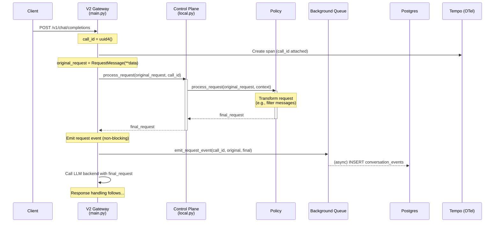
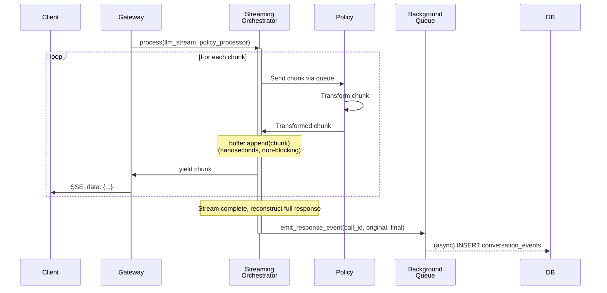
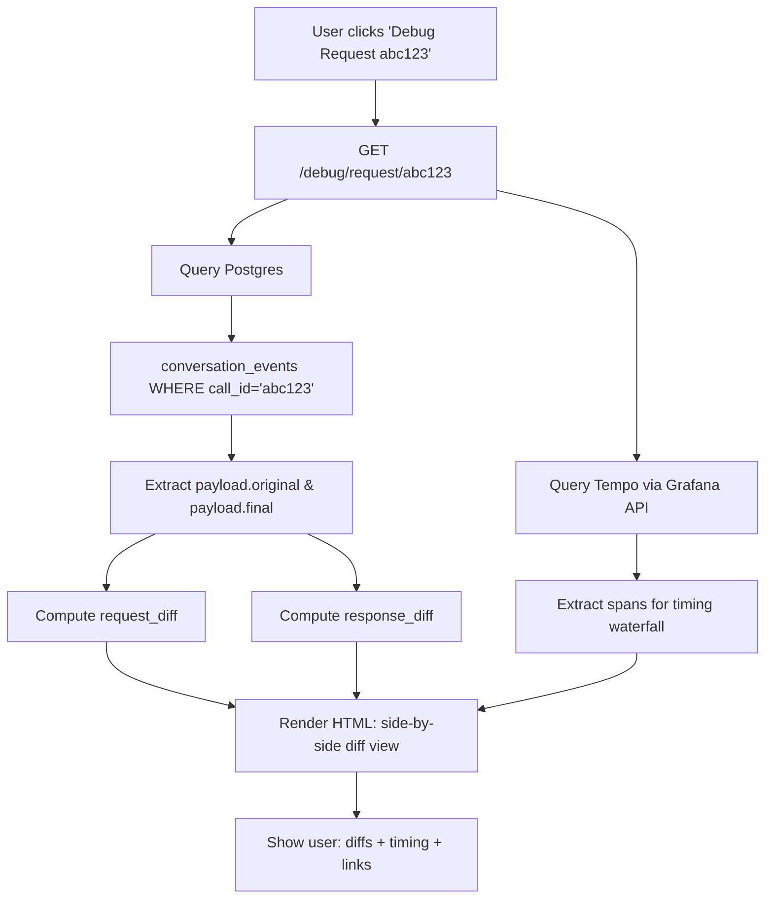

# V2 Observability Implementation Plan

**Created:** 2025-10-20
**Status:** In Progress
**Estimated Time:** 5-8 hours

---

## Overview

Implement comprehensive observability for V2 architecture to support policy debugging and performance analysis. This includes:
- Before/after diff view for requests and responses
- Real-time activity monitoring via existing Redis pub/sub
- Full payload inspection in PostgreSQL
- Performance analytics via Tempo + conversation_events queries

---

## Architecture Diagrams

### Diagram 1: V2 Request Flow with Event Emission



### Diagram 2: Streaming Flow with Non-Blocking Buffer



### Diagram 3: Debug Endpoint Data Flow



---

## Worked Example: Content Filter Policy

### Scenario
Policy that redacts PII from responses before sending to client.

### Flow

**1. Request arrives:**
```json
{
  "model": "claude-opus-4-1",
  "messages": [{"role": "user", "content": "What's my account number?"}]
}
```

**2. Policy processes request (passthrough in this case):**
```python
# In policy.process_request()
# No changes needed, return as-is
return request
```

**3. Event emitted to DB (non-blocking queue):**
```python
# conversation_events table
{
  "call_id": "abc-123",
  "event_type": "request",
  "sequence": 1697234567000000000,
  "payload": {
    "original": {
      "model": "claude-opus-4-1",
      "messages": [{"role": "user", "content": "What's my account number?"}]
    },
    "final": {
      "model": "claude-opus-4-1",
      "messages": [{"role": "user", "content": "What's my account number?"}]
    }
  }
}
```

**4. LLM responds:**
```json
{
  "choices": [{
    "message": {"role": "assistant", "content": "Your account number is 1234-5678-9012."}
  }]
}
```

**5. Policy processes response (REDACTS PII):**
```python
# In policy.process_full_response()
original_response = response

# Redact PII
final_response = response.copy()
final_response.choices[0].message.content = "Your account number is [REDACTED]."

# Optionally record policy decision
ctx.emit(
    event_type="policy.pii_redacted",
    summary="Redacted account number from response",
    details={"pattern": "account_number", "location": "message.content"},
    severity="info"
)

return final_response
```

**6. Event emitted to DB:**
```python
# conversation_events table
{
  "call_id": "abc-123",
  "event_type": "response",
  "sequence": 1697234568000000000,
  "payload": {
    "original": {
      "message": {"role": "assistant", "content": "Your account number is 1234-5678-9012."}
    },
    "final": {
      "message": {"role": "assistant", "content": "Your account number is [REDACTED]."}
    }
  }
}
```

**7. OTel span event recorded (from ctx.emit()):**
```python
# Span event attributes
{
  "event.type": "policy.pii_redacted",
  "event.summary": "Redacted account number from response",
  "event.pattern": "account_number",
  "event.location": "message.content",
  "event.severity": "info"
}
```

**8. Redis pub/sub event (optional, for live monitoring):**
```json
{
  "call_id": "abc-123",
  "event_type": "policy.pii_redacted",
  "timestamp": "2024-01-15T10:30:00Z",
  "data": {
    "summary": "Redacted account number from response",
    "severity": "info",
    "pattern": "account_number"
  }
}
```

**9. Debug view shows:**
```
Response Diff:
  message.content:
    - "Your account number is 1234-5678-9012."  (RED)
    + "Your account number is [REDACTED]."      (GREEN)

Policy Events:
  ✓ policy.pii_redacted - Redacted account number from response

Timing:
  gateway.chat_completions: 1.2s
  ├─ control_plane.process_request: 0.001s
  ├─ llm_backend_call: 1.1s
  └─ control_plane.process_full_response: 0.099s
      └─ policy.pii_redacted: 0.098s
```

---

## Implementation Phases

### Phase 1: V2 Event Pipeline (2-3 hours)

#### Task 1.1: Create event emission helpers (1 hour)
- [ ] Create `src/luthien_proxy/v2/storage/` directory
- [ ] Create `src/luthien_proxy/v2/storage/__init__.py`
- [ ] Create `src/luthien_proxy/v2/storage/events.py` with:
  - `emit_request_event(call_id, original, final, db_pool)`
  - `emit_response_event(call_id, original, final, db_pool)`
  - Reuse `build_conversation_events()` from V1
  - Submit to `CONVERSATION_EVENT_QUEUE` (non-blocking)

**Files to create:**
- `src/luthien_proxy/v2/storage/__init__.py`
- `src/luthien_proxy/v2/storage/events.py`

**Dependencies:**
- Import from `luthien_proxy.control_plane.conversation`
- Import from `luthien_proxy.control_plane.utils.task_queue`

#### Task 1.2: Wire gateway non-streaming flow (45 min)
- [ ] Modify `src/luthien_proxy/v2/main.py`:
  - Import event helpers
  - After `process_request()`: emit request event
  - After `process_full_response()`: emit response event
  - Ensure db_pool is accessible (from lifespan context)

**Files to modify:**
- `src/luthien_proxy/v2/main.py`

**Key points:**
- Events are fire-and-forget (submitted to queue, not awaited)
- Call ID must be non-null (assert before submission)

#### Task 1.3: Wire streaming flow with non-blocking buffer (1-1.5 hours)
- [ ] Modify `src/luthien_proxy/v2/control/streaming.py`:
  - Add chunk buffering in `StreamingOrchestrator.process()`
  - Buffer is just `append()` as chunks flow through
  - After stream completes: reconstruct full response
  - Emit response event via queue
- [ ] Modify `src/luthien_proxy/v2/control/local.py`:
  - Pass original response to streaming orchestrator
  - Ensure call_id flows through

**Files to modify:**
- `src/luthien_proxy/v2/control/streaming.py`
- `src/luthien_proxy/v2/control/local.py`

**Key points:**
- Buffering must not block streaming (append-only, nanoseconds)
- Persistence happens AFTER stream completes via queue
- Need to reconstruct full response from buffered chunks

---

### Phase 2: Diff View & Debug Endpoint (2-3 hours)

#### Task 2.1: Create diff computation module (1 hour)
- [ ] Create `src/luthien_proxy/debug/` directory
- [ ] Create `src/luthien_proxy/debug/__init__.py`
- [ ] Create `src/luthien_proxy/debug/diff.py` with:
  - `DiffResult` dataclass (added, removed, modified, unchanged, summary)
  - `compute_diff(original: dict, final: dict, path: str = "") -> DiffResult`
    - Recursive structural diff for nested dicts
    - Track field paths like `"messages[0].content"`
  - `summarize_diff(diff: DiffResult) -> str`
    - Short summary for OTel attributes

**Files to create:**
- `src/luthien_proxy/debug/__init__.py`
- `src/luthien_proxy/debug/diff.py`

**Test cases to support:**
- Flat dict diff
- Nested dict diff
- Array element diff
- Type changes (e.g., string → int)

#### Task 2.2: Create debug endpoint (1 hour)
- [ ] Create `src/luthien_proxy/debug/endpoint.py` with:
  - `query_conversation_events(call_id: str, db_pool) -> dict`
  - `query_tempo_via_grafana(call_id: str) -> list`
  - `build_timing_waterfall(spans: list) -> dict`
  - `debug_request_handler(call_id: str)` - main endpoint logic
- [ ] Modify `src/luthien_proxy/v2/main.py`:
  - Add route: `@app.get("/debug/request/{call_id}")`
  - Wire to debug_request_handler

**Files to create:**
- `src/luthien_proxy/debug/endpoint.py`

**Files to modify:**
- `src/luthien_proxy/v2/main.py`

**Key points:**
- Query Postgres for conversation_events by call_id
- Extract `payload["original"]` and `payload["final"]`
- Query Tempo via Grafana API (document coupling)
- TODO comment: Consider direct Tempo HTTP API in future

#### Task 2.3: Create HTML debug UI (1 hour)
- [ ] Create `src/luthien_proxy/v2/templates/debug_request.html`:
  - Side-by-side JSON diff with syntax highlighting
  - Color coding: green (added), red (removed), yellow (modified)
  - Collapsible JSON trees
  - Timing waterfall chart (SVG or HTML table)
  - Link to Grafana full trace
  - Copy buttons for each section
  - Download JSON buttons
- [ ] Create `src/luthien_proxy/v2/static/debug.css`:
  - Styling for diff view
  - Dark mode theme (consistent with activity monitor)

**Files to create:**
- `src/luthien_proxy/v2/templates/debug_request.html`
- `src/luthien_proxy/v2/static/debug.css`

**UI Features:**
- Responsive layout
- Keyboard navigation
- Print-friendly
- Copy-paste friendly JSON

---

### Phase 3: Tests & Documentation (1-2 hours)

#### Task 3.1: Write unit tests (30 min)
- [ ] Create `tests/unit_tests/v2/test_storage_events.py`:
  - Test `emit_request_event()` builds correct payload
  - Test `emit_response_event()` builds correct payload
  - Test queue submission (mock queue)
- [ ] Create `tests/unit_tests/v2/test_debug_diff.py`:
  - Test flat dict diff
  - Test nested dict diff
  - Test array diff
  - Test type change diff
  - Test summary generation

**Files to create:**
- `tests/unit_tests/v2/test_storage_events.py`
- `tests/unit_tests/v2/test_debug_diff.py`

#### Task 3.2: Write integration tests (30 min)
- [ ] Create `tests/integration_tests/v2/test_debug_endpoint.py`:
  - Test query_conversation_events retrieves correct data
  - Test compute_diff on real payloads
  - Test HTML rendering (status 200, contains expected elements)
- [ ] Create `tests/e2e_tests/v2/test_conversation_events.py`:
  - Make request to V2 gateway
  - Verify conversation_event appears in DB
  - Verify payload.original and payload.final are correct

**Files to create:**
- `tests/integration_tests/v2/test_debug_endpoint.py`
- `tests/e2e_tests/v2/test_conversation_events.py`

#### Task 3.3: Update documentation (30 min)
- [ ] Update `dev/context/observability-guide.md`:
  - Add section: "V2 Event Pipeline"
  - Document that V2 bypasses LiteLLM callbacks
  - Explain non-blocking buffering during streaming
  - Note Grafana API coupling
  - Fix Prisma path: `prisma/control_plane/schema.prisma`
- [ ] Create `docs/POLICY_DEBUGGING.md`:
  - Overview of debugging workflow
  - How to use `/debug/request/<call_id>`
  - Examples for 3 use cases:
    1. Policy development (testing new policy)
    2. API compatibility (OpenAI vs Anthropic)
    3. Backend comparison (model A vs model B)
  - Screenshots (can be added later)
- [ ] Update `dev/context/observability-architecture-proposal.md`:
  - Mark as superseded by this implementation

**Files to modify:**
- `dev/context/observability-guide.md`

**Files to create:**
- `docs/POLICY_DEBUGGING.md`

---

## Key Technical Details

### Non-Blocking Buffer Implementation

```python
# In StreamingOrchestrator.process()
buffered_chunks = []

async for chunk in outgoing_queue:
    # 1. Yield immediately (non-blocking)
    yield chunk

    # 2. Buffer for later persistence (nanoseconds, non-blocking)
    buffered_chunks.append(chunk)

# After iteration completes (stream done):
if buffered_chunks:
    # Reconstruct full response from chunks
    final_response = reconstruct_full_response(buffered_chunks)

    # Emit to background queue (non-blocking)
    CONVERSATION_EVENT_QUEUE.submit(
        emit_response_event(call_id, original_response, final_response, db_pool)
    )
```

### Call ID Lifecycle

1. **Generated at gateway boundary:**
   ```python
   call_id = str(uuid.uuid4())
   ```

2. **Attached to OTel span immediately:**
   ```python
   span.set_attribute("luthien.call_id", call_id)
   ```

3. **Passed through all layers:**
   - Gateway → Control Plane → Policy → Storage

4. **Asserted non-null before persistence:**
   ```python
   def emit_request_event(call_id, original, final, db_pool):
       assert call_id, "call_id must be non-null"
       # ... build and submit event
   ```

### Tempo Integration Strategy

**Phase 1 (Current):**
- Query via Grafana API: `/api/datasources/proxy/{datasource_uid}/api/traces?call_id={call_id}`
- Document this coupling in code comments
- Pros: Reuses existing Grafana infrastructure
- Cons: Adds dependency layer, requires Grafana to be running

**Future Optimization:**
- Direct Tempo HTTP API: `http://tempo:3200/api/traces/{trace_id}`
- Reduces dependencies
- Faster (no Grafana proxy layer)
- Add TODO comment in code for future work

---

## Database Schema Reference

### conversation_events Table

```sql
CREATE TABLE conversation_events (
    id UUID PRIMARY KEY DEFAULT uuid_generate_v4(),
    call_id TEXT NOT NULL,
    event_type TEXT NOT NULL,  -- 'request' or 'response'
    sequence BIGINT NOT NULL,  -- nanosecond timestamp
    payload JSONB NOT NULL,    -- {original: {...}, final: {...}}
    created_at TIMESTAMP WITH TIME ZONE DEFAULT NOW(),

    FOREIGN KEY (call_id) REFERENCES conversation_calls(call_id) ON DELETE CASCADE
);

CREATE INDEX idx_conversation_events_call_sequence ON conversation_events(call_id, sequence);
CREATE INDEX idx_conversation_events_type ON conversation_events(event_type);
```

### Payload Structure

```json
{
  "original": {
    // Original request/response before policy
    "model": "claude-opus-4-1",
    "messages": [...]
  },
  "final": {
    // Final request/response after policy
    "model": "claude-opus-4-1",
    "messages": [...]  // May be different from original
  },
  // For backwards compatibility (top-level uses final values)
  "model": "claude-opus-4-1",
  "messages": [...]
}
```

---

## Progress Tracking

### Phase 1: Event Pipeline
- [x] Task 1.1: Event emission helpers ✅ COMPLETED
  - Created `src/luthien_proxy/v2/storage/events.py`
  - Created `src/luthien_proxy/v2/storage/__init__.py`
  - Functions: `emit_request_event()`, `emit_response_event()`
  - Both functions use background queue (non-blocking)
- [x] Task 1.2: Wire non-streaming flow ✅ COMPLETED
  - Added `DATABASE_URL` config to `src/luthien_proxy/v2/main.py`
  - Added `db_pool` initialization in lifespan
  - Wired event emission into `/v1/chat/completions` (lines 239-245, 299-305)
  - Wired event emission into `/v1/messages` (lines 349-355, 386-392)
  - Fixed import order (db before v2 imports)
  - Ran ruff format and check (all passing)
- [ ] Task 1.3: Wire streaming flow ⏳ NEXT
  - Need to modify `StreamingOrchestrator` to buffer chunks
  - Need to reconstruct full response from chunks
  - Need to emit response event after stream completes

### Phase 2: Diff View
- [ ] Task 2.1: Diff computation
- [ ] Task 2.2: Debug endpoint
- [ ] Task 2.3: HTML UI

### Phase 3: Tests & Docs
- [ ] Task 3.1: Unit tests
- [ ] Task 3.2: Integration tests
- [ ] Task 3.3: Documentation

---

## Time Estimates

| Phase | Task | Estimated | Actual | Notes |
|-------|------|-----------|--------|-------|
| 0 | Planning doc | 30 min | 30 min | ✅ Complete with diagrams |
| 1.1 | Event helpers | 1 hour | 45 min | ✅ Complete, clean code |
| 1.2 | Wire non-streaming | 45 min | 30 min | ✅ Complete, both endpoints |
| 1.3 | Wire streaming | 1-1.5 hours | | ⏳ In progress |
| 2.1 | Diff computation | 1 hour | | |
| 2.2 | Debug endpoint | 1 hour | | |
| 2.3 | HTML UI | 1 hour | | |
| 3.1 | Unit tests | 30 min | | |
| 3.2 | Integration tests | 30 min | | |
| 3.3 | Documentation | 30 min | | |
| **TOTAL** | | **5-8 hours** | **~1.75h so far** | On track |

---

## Open Questions / Decisions

1. **Streaming response reconstruction:**
   - How to reconstruct full response from chunks?
   - Option A: Accumulate all chunk content into single message
   - Option B: Store chunks array and reconstruct on query
   - **Decision:** TBD during implementation

2. **Grafana API authentication:**
   - Does Grafana require auth for API queries?
   - **Decision:** Test during Phase 2.2

3. **Payload size limits:**
   - Should we truncate very large payloads?
   - **Decision:** Store full payloads initially, optimize later if needed

---

## Success Criteria

- [ ] V2 events appear in `conversation_events` table
- [ ] Events have correct `payload.original` and `payload.final`
- [ ] Debug endpoint returns 200 with valid HTML
- [ ] Diff view correctly highlights added/removed/modified fields
- [ ] Timing waterfall shows span hierarchy
- [ ] All tests pass
- [ ] Documentation is clear and comprehensive
