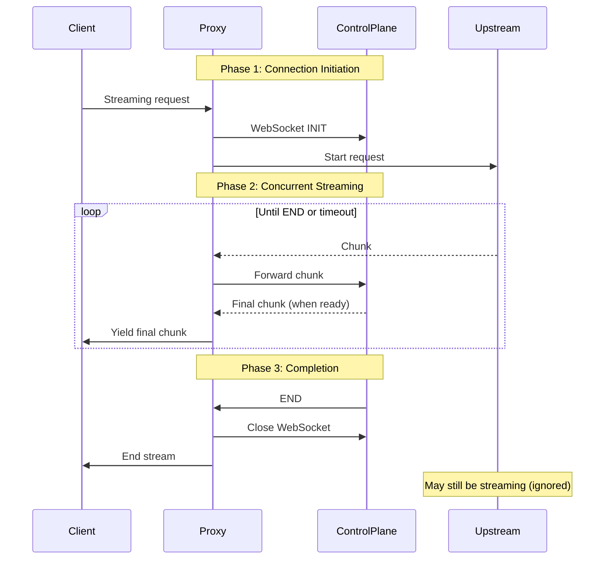
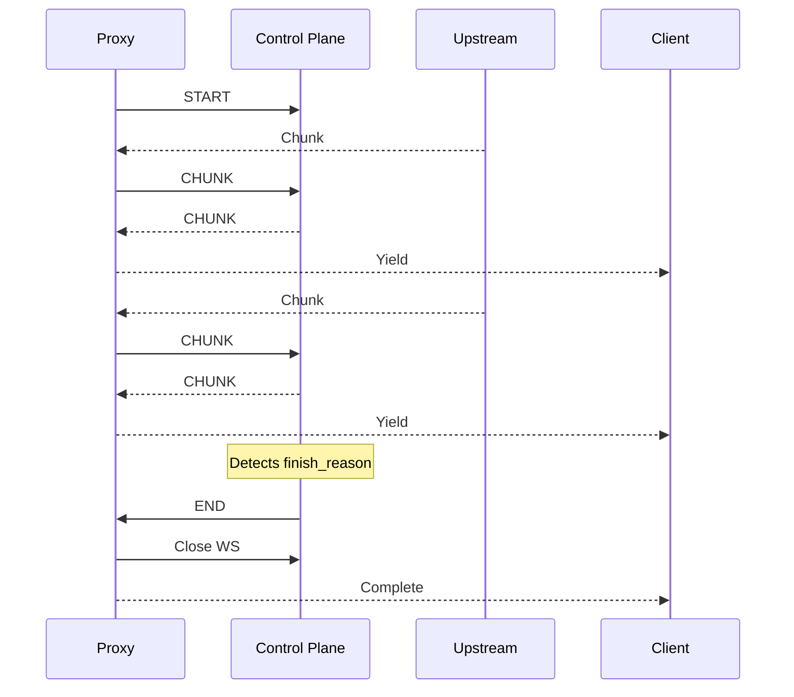
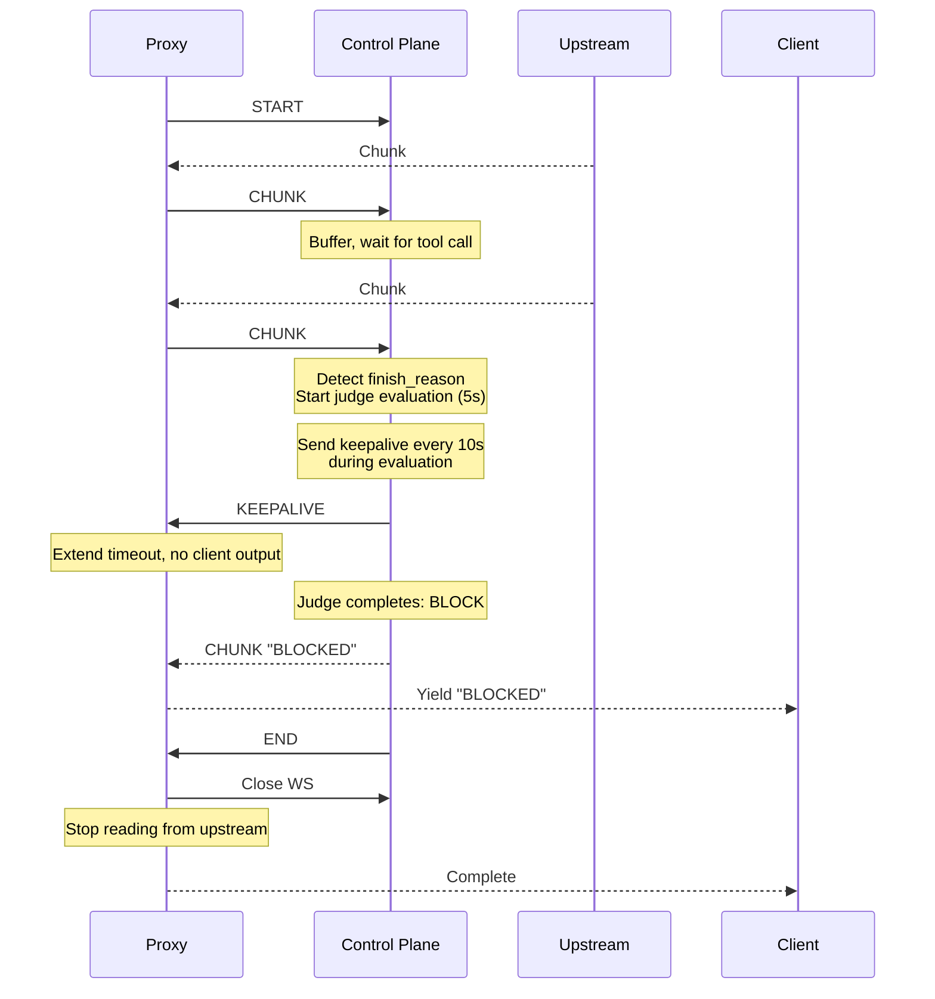

# Streaming Rewrite Plan: Bidirectional LiteLLM ↔ Control Plane

**Status**: Implementation Plan
**Created**: 2025-10-05
**Updated**: 2025-10-05 (added fixes for JSON serialization, keepalive, resource cleanup)
**Goal**: Rewrite `async_post_call_streaming_iterator_hook` to implement clean bidirectional streaming protocol

## Critical Fixes Applied to Plan

This plan addresses three critical issues identified during review:

1. **JSON Serialization Bug** (MAJOR)
   - **Issue**: Plan forwarded raw `ModelResponseStream` objects to WebSocket
   - **Impact**: Would crash with `TypeError: Object of type ModelResponseStream is not JSON serializable`
   - **Fix**: Line 316 now calls `chunk.model_dump()` before sending

2. **Timeout Logic for Slow Policies** (MAJOR)
   - **Issue**: 30s timeout would fire even if control plane legitimately processing (e.g., policies that buffer the full upstream before emitting)
   - **Impact**: Timeouts on valid requests with slow LLM responses or heavy processing
   - **Fix**: Added `KEEPALIVE` message type allowing control plane to signal "I'm alive" without sending content

3. **Resource Leak on Early Exit** (MEDIUM)
   - **Issue**: Returning empty response without consuming/closing upstream iterator
   - **Impact**: LLM request continues running in background, wasting resources
   - **Fix**: Lines 417, 430 now call `await response.aclose()` before early returns

## Protocol Overview

The streaming architecture uses a bidirectional WebSocket protocol between the LiteLLM proxy and the control plane:

### Message Format

All messages are JSON objects with a `type` field and optional `data`/`error` fields:

```json
{"type": "MESSAGE_TYPE", "data": {...}}
```

### Message Types

**Proxy → Control Plane:**
- `START` - Connection initiation with request metadata
- `CHUNK` - Upstream LLM response chunk (forwarded as-is)
- `END` - Upstream stream completed (sent by proxy)

**Control Plane → Proxy:**
- `CHUNK` - Final response chunk (policy output, sent to client)
- `KEEPALIVE` - Heartbeat to extend timeout (no client output)
- `END` - Policy stream completed successfully
- `ERROR` - Policy encountered an error

### Key Terms

- **Upstream**: The original LLM provider response (e.g., OpenAI, Anthropic)
- **Control Plane**: The policy evaluation service receiving upstream chunks
- **Final Response**: What the control plane sends back (may differ from upstream)
- **Client**: The end user making the request through the proxy

### Flow Summary

1. Proxy opens WebSocket, sends `START` with request metadata
2. Proxy forwards upstream chunks via `CHUNK` messages
3. Control plane processes and emits its own `CHUNK` messages
4. Control plane sends `END` when complete (or `ERROR` on failure)
5. Proxy returns final chunks to client, closes connection

**Critical Principle**: The client receives ONLY what the control plane explicitly sends. The control plane's response may be identical to upstream (NoOp policy), transformed (AllCaps policy), blocked (judge policy), or any other policy-defined behavior.

## Executive Summary

The current streaming implementation is fundamentally confused about its role: it thinks it's "transforming" upstream responses when architecturally the control plane generates **independent responses**. This mismatch has caused timeout issues, race conditions, and unclear failure modes.

We're rewriting from scratch to implement a clean protocol where:
- **Control plane is the canonical source of responses**
- Client receives NOTHING unless control plane explicitly sends it
- Clear completion semantics (END signal from control plane)
- Proper timeout and failure handling (return empty response)

## Core Architectural Principle

**The control plane generates its own response, informed by (but independent of) the upstream LLM response.**

This is NOT a transformation pipeline. The two streams are architecturally separate:
- **Original stream**: Upstream LLM → Proxy → Control Plane
- **Final stream**: Control Plane → Proxy → Client

They happen to be correlated (NoOp policy copies chunks, Judge policy uses them for evaluation), but the architecture must not assume any relationship.

## Critical Requirements

### 1. Control Plane is Canonical (Deny-by-Default)

**Requirement**: Client receives ONLY what control plane explicitly sends.

**Implications**:
- Proxy NEVER forwards upstream content directly to client
- On any failure (connection, timeout, error): return empty response
- No fallback to passthrough mode

**Why**: Security and control. Prevents unapproved content from leaking. Aligns with AI control principles.

### 2. Bidirectional Communication on Single Connection

**Requirement**: Proxy must send original chunks AND receive final chunks on same WebSocket.

**Constraint**: LiteLLM is behind NAT/firewall - control plane cannot initiate connections.

**Implications**:
- Single WebSocket connection opened by proxy
- Both directions use this connection concurrently
- Connection lifecycle managed by proxy

### 3. Clear Completion Semantics

**Requirement**: Both sides must know when streams are done, no ambiguity.

**Protocol**:
- Control plane sends `{"type": "END"}` when policy completes
- Proxy closes connection immediately upon receiving END from control plane
- Proxy sends `{"type": "END"}` when upstream completes (control plane can also detect via `finish_reason`)

**Why**: LiteLLM callback blocks until generator completes. Must exit cleanly when control plane is done, even if upstream still streaming.

### 4. Timeout for Control Plane Response

**Requirement**: If control plane doesn't respond within timeout, fail gracefully.

**Default**: 30 seconds (configurable)
**Trigger**: No chunks received from control plane within window
**Behavior**: Return empty response to client

**Why**: Control plane might hang, crash, or have slow policy (judge evaluation). Client shouldn't wait forever.

**NOT a timeout**: If control plane actively streaming (sending chunks), no timeout even if >30s total.

## Protocol Design

See **Protocol Overview** section above for full message type reference. This section focuses on specific flows and edge cases.

### Connection Lifecycle



### Scenario Flows

#### Success: Fast Policy (NoOp)



#### Success: Slow Policy (Judge - Blocks Early)



#### Failure: Control Plane Timeout


#### Failure: Connection Broken


## Implementation Structure

### High-Level Architecture

```
litellm_callback.py
├── ControlPlaneCallback
│   └── async_post_call_streaming_iterator_hook()  ← Main entry point
│       ├── Setup & connection
│       ├── StreamOrchestrator.run()               ← Core logic
│       └── Cleanup & error handling
│
stream_orchestrator.py (NEW)
├── StreamOrchestrator                              ← Manages bidirectional streaming
│   ├── __init__(connection, upstream, timeout)
│   ├── run() → AsyncGenerator                      ← Main loop
│   ├── _forward_upstream()                         ← Task: send chunks to control plane
│   ├── _receive_control_plane()                    ← Task: receive from control plane
│   └── _poll_with_timeout()                        ← Yield chunks with timeout
│
└── StreamState (Enum)                              ← Clean state machine
    ├── ACTIVE
    ├── ENDED (received END)
    └── FAILED (error/timeout)
```

### Key Classes

#### StreamOrchestrator

**Responsibility**: Coordinate concurrent upstream forwarding and control plane polling.

```python
class StreamState(Enum):
    ACTIVE = "active"      # Normal operation
    ENDED = "ended"        # Received END
    FAILED = "failed"      # Error or timeout

class StreamOrchestrator:
    """Manages bidirectional streaming between upstream LLM and control plane.

    Architecture:
    - Forwards upstream chunks to control plane (fire-and-forget)
    - Polls control plane for final response chunks
    - Yields only control plane chunks to client
    - Handles timeout, END, and errors
    """

    def __init__(
        self,
        connection: WebSocketConnection,
        upstream: AsyncIterator[ModelResponseStream],
        timeout: float = 30.0,
    ):
        self.connection = connection
        self.upstream = upstream
        self.timeout = timeout
        self.state = StreamState.ACTIVE
        self.deadline = time.time() + timeout
        self.last_activity = time.time()

    async def run(self) -> AsyncGenerator[ModelResponseStream, None]:
        """Main orchestration loop.

        Yields:
            Final response chunks from control plane

        Raises:
            TimeoutError: If no control plane activity within timeout
        """
        # Launch background task to forward upstream
        forward_task = asyncio.create_task(self._forward_upstream())

        try:
            # Poll control plane and yield chunks
            async for chunk in self._poll_control_plane():
                yield chunk

                if self.state == StreamState.ENDED:
                    break
        finally:
            forward_task.cancel()
            with contextlib.suppress(asyncio.CancelledError):
                await forward_task
```

#### Key Methods

```python
async def _forward_upstream(self) -> None:
    """Background task: forward upstream chunks to control plane.

    Continues until:
    - Upstream exhausts
    - State changes to ENDED/FAILED
    - Task is cancelled
    """
    try:
        async for chunk in self.upstream:
            if self.state != StreamState.ACTIVE:
                break

            try:
                await self.connection.send({"type": "CHUNK", "data": chunk.model_dump()})
            except Exception as exc:
                logger.error(f"Failed to forward chunk: {exc}")
                self.state = StreamState.FAILED
                break
    except Exception as exc:
        logger.error(f"Upstream iteration failed: {exc}")
        self.state = StreamState.FAILED

async def _poll_control_plane(self) -> AsyncGenerator[ModelResponseStream, None]:
    """Poll control plane for final response chunks with timeout.

    Yields chunks until:
    - END received
    - Timeout exceeded
    - ERROR received
    - Connection broken
    """
    receive_task = None

    while self.state == StreamState.ACTIVE:
        # Check timeout
        remaining = self.deadline - time.time()
        if remaining <= 0:
            logger.warning("Control plane timeout")
            self.state = StreamState.FAILED
            break

        # Schedule receive if needed
        if receive_task is None or receive_task.done():
            receive_task = asyncio.create_task(self.connection.receive())

        # Wait for message with timeout
        done, _ = await asyncio.wait(
            {receive_task},
            timeout=min(0.1, remaining)  # Poll every 100ms
        )

        if not done:
            continue  # No message yet, loop

        # Process message
        try:
            message = receive_task.result()
        except Exception as exc:
            logger.error(f"Receive failed: {exc}")
            self.state = StreamState.FAILED
            break

        if message is None:
            # Connection closed
            self.state = StreamState.FAILED
            break

        msg_type = message.get("type")

        if msg_type == "CHUNK":
            # Update activity timestamp
            self.last_activity = time.time()
            self.deadline = self.last_activity + self.timeout

            # Yield to client
            chunk_data = message.get("data")
            yield self._normalize_chunk(chunk_data)

        elif msg_type == "KEEPALIVE":
            # Extend timeout without yielding anything
            self.last_activity = time.time()
            self.deadline = self.last_activity + self.timeout
            logger.debug("Received keepalive, extended deadline")

        elif msg_type == "END":
            self.state = StreamState.ENDED
            break

        elif msg_type == "ERROR":
            logger.error(f"Control plane error: {message.get('error')}")
            self.state = StreamState.FAILED
            break

        # Prepare for next iteration
        receive_task = None
```

### Main Hook Integration

```python
async def async_post_call_streaming_iterator_hook(
    self,
    user_api_key_dict: Any,
    response: AsyncGenerator[ModelResponseStream, None],
    request_data: dict[str, Any],
) -> AsyncGenerator[ModelResponseStream, None]:
    """Forward streaming through control plane.

    Control plane is canonical source - client receives ONLY what control plane sends.
    On any error: return empty response (deny-by-default).
    """
    stream_id = request_data.get("litellm_call_id")
    if not stream_id:
        # No stream ID - close upstream and return empty
        await response.aclose()
        return

    # Open connection to control plane
    try:
        manager = self._get_connection_manager()
        connection = await manager.get_or_create(
            stream_id,
            self._json_safe(request_data)
        )
    except Exception as exc:
        logger.error(f"Failed to connect to control plane: {exc}")
        # Close upstream to avoid resource leak
        await response.aclose()
        return  # Empty response

    # Run orchestrator
    try:
        orchestrator = StreamOrchestrator(
            connection=connection,
            upstream=response,
            timeout=30.0,  # TODO: Make configurable
        )

        async for chunk in orchestrator.run():
            yield chunk

    except Exception as exc:
        logger.error(f"Streaming orchestration failed: {exc}")
        # Return empty (already yielded any chunks before error)

    finally:
        # Always clean up connection
        try:
            await manager.close(stream_id)
        except Exception as exc:
            logger.error(f"Failed to close connection: {exc}")
```

## Critical Implementation Details

### 1. Timeout is Activity-Based, Not Total Duration

**Correct**: Timeout resets when control plane sends a chunk OR keepalive
```python
if msg_type == "CHUNK":
    self.last_activity = time.time()
    self.deadline = self.last_activity + self.timeout  # Reset
    yield chunk

elif msg_type == "KEEPALIVE":
    self.last_activity = time.time()
    self.deadline = self.last_activity + self.timeout  # Reset
    # No yield - just extends timeout
```

**Why**: Policy might stream a long response over >30 seconds. That's fine as long as it's actively sending chunks. We only timeout if NO activity for 30 seconds.

**Keepalive Use Case**: Policies that need to wait for the full upstream before emitting anything (e.g., policies that buffer and analyze the complete response before deciding what to emit). The control plane can send `{"type": "KEEPALIVE"}` periodically (e.g., every 10 seconds) to signal "I'm alive and working" without sending actual content. This prevents timeout during long processing periods.

### 2. Detect Original Stream Completion via finish_reason

Control plane must recognize when upstream is done by examining chunk metadata:

```python
# In policy's generate_response_stream()
async for chunk in incoming_stream:
    # Check for completion
    finish_reason = self._extract_finish_reason(chunk)
    if finish_reason:
        # Stream is complete, do final processing
        ...
        return  # Stops generator, triggers END
```

Common `finish_reason` values:
- `"stop"` - Normal completion
- `"tool_calls"` - Tool call complete (judge policy cares about this)
- `"length"` - Max tokens reached
- `"content_filter"` - Filtered

**Gotcha**: `finish_reason` location varies by provider and streaming vs. non-streaming.

Streaming format:
```python
{
    "choices": [{
        "index": 0,
        "delta": {"content": "text"},
        "finish_reason": "stop"  # ← Here in streaming
    }]
}
```

Need robust extraction:
```python
def _extract_finish_reason(self, chunk: dict) -> str | None:
    """Extract finish_reason from chunk, handling both streaming and non-streaming."""
    choices = chunk.get("choices", [])
    if not choices:
        return None

    choice = choices[0]

    # Try delta first (streaming)
    finish_reason = choice.get("finish_reason")
    if finish_reason:
        return finish_reason

    # Try message (non-streaming fallback)
    message = choice.get("message", {})
    return message.get("finish_reason")
```

### 3. Empty Response in Streaming Context

When returning empty response due to error/timeout, we must:
1. Close the upstream generator to avoid resource leaks
2. Return without yielding anything

```python
async def async_post_call_streaming_iterator_hook(...):
    stream_id = request_data.get("litellm_call_id")
    if not stream_id:
        await response.aclose()  # CRITICAL: Close upstream
        return

    try:
        connection = await manager.get_or_create(...)
    except Exception:
        await response.aclose()  # CRITICAL: Close upstream
        return

    try:
        # ... orchestration ...
        async for chunk in orchestrator.run():
            yield chunk
    except Exception:
        return  # Orchestrator already manages upstream cleanup
```

**Why**: The `response` generator represents an active LLM request. If we don't consume or close it, the request may continue running, wasting resources. Calling `aclose()` explicitly terminates the upstream request.

LiteLLM will handle this gracefully - client sees immediate end-of-stream.

### 4. Concurrent Task Cancellation

The upstream forwarding task runs in background. MUST be cancelled properly:

```python
forward_task = asyncio.create_task(self._forward_upstream())

try:
    async for chunk in self._poll_control_plane():
        yield chunk
finally:
    # CRITICAL: Cancel background task
    forward_task.cancel()
    with contextlib.suppress(asyncio.CancelledError):
        await forward_task  # Wait for cancellation
```

**Why**: If we don't cancel, task might continue trying to send to closed WebSocket, causing errors.

### 5. WebSocket Send Failures

When forwarding upstream chunk fails, mark as failed but don't crash:

```python
try:
    await self.connection.send({"type": "CHUNK", "data": chunk})
except Exception as exc:
    logger.error(f"Failed to forward chunk: {exc}")
    self.state = StreamState.FAILED
    # Don't raise - let polling loop detect failure state
```

**Why**: Send failure means connection is broken. We want to cleanly exit poll loop and return empty response, not crash with exception.

## Testing Strategy

### 1. Unit Tests for StreamOrchestrator

**Test Cases**:
- Normal flow: upstream chunks → control plane chunks → client
- END: stops immediately
- Timeout: no control plane activity for 30s → empty response
- Connection broken: detect and return empty
- Control plane ERROR: return empty
- Upstream faster than control plane: buffering works
- Control plane faster than upstream: works (judge blocking)

### 2. Integration Tests with Mock Control Plane

**Test Cases**:
- Mock control plane that immediately responds (NoOp simulation)
- Mock control plane that delays 5s then responds (Judge simulation)
- Mock control plane that never responds (timeout test)
- Mock control plane that sends ERROR
- Mock control plane that disconnects mid-stream

### 3. E2E Tests with Real LLM Providers

**Critical Test**: Verify `finish_reason` detection works with real providers

```python
@pytest.mark.e2e
async def test_finish_reason_detection_openai():
    """Verify control plane detects stream end from OpenAI finish_reason."""
    # Send real request to OpenAI via proxy
    # Control plane should detect finish_reason="stop"
    # Should send END
    # Client should receive complete response

@pytest.mark.e2e
async def test_finish_reason_detection_anthropic():
    """Verify control plane detects stream end from Anthropic finish_reason."""
    # Same as above but with Claude

@pytest.mark.e2e
async def test_finish_reason_detection_tool_calls():
    """Verify control plane detects finish_reason='tool_calls' for judge."""
    # Use GPT-4 with tools
    # Should detect finish_reason="tool_calls"
    # Judge policy should evaluate correctly
```

**Why Critical**: Our protocol assumes `finish_reason` detection works. If providers don't send it consistently, the whole system breaks.

### 4. Keepalive Mechanism Tests

**Test Cases**:
- Policy sends keepalive every 10s while buffering upstream
- Slow upstream (>30s) with keepalives doesn't timeout
- Policy that sends keepalive then crashes still times out after 30s from last keepalive
- Keepalive doesn't yield any chunks to client

```python
@pytest.mark.asyncio
async def test_keepalive_prevents_timeout():
    """Verify keepalive extends deadline without timing out."""
    # Mock control plane that:
    # - Sends KEEPALIVE at t=0s, t=10s, t=20s, t=30s
    # - Sends CHUNK at t=40s
    # - Sends END at t=41s
    # Should succeed even though >30s total duration

@pytest.mark.asyncio
async def test_keepalive_no_client_output():
    """Verify keepalive doesn't yield chunks to client."""
    # Mock control plane sends KEEPALIVE
    # Client should receive nothing (no chunk yielded)
```

### 5. Existing Test Updates

**E2E parameterized tests** (`test_policies_parameterized.py`):
- Should all pass with new implementation
- Currently 9/10 pass (judge streaming fails due to timeout bug)
- After rewrite: should be 10/10 passing

**Policy-specific tests** (e.g., `test_tool_call_judge_e2e.py`):
- Already test streaming and non-streaming
- Should continue to pass
- Policies that buffer may need keepalive implementation for very slow LLM responses

## Migration Path

### Step 1: Create New Module

Create `src/luthien_proxy/proxy/stream_orchestrator.py`:
- `StreamState` enum
- `StreamOrchestrator` class
- Unit tests in `tests/unit_tests/proxy/test_stream_orchestrator.py`

### Step 2: Rewrite Hook

Update `config/litellm_callback.py`:
- Keep existing methods except `async_post_call_streaming_iterator_hook`
- Rewrite hook to use `StreamOrchestrator`
- Remove old `poll_control` nested function
- Remove `passthrough` flag and logic

### Step 3: Add Keepalive Support to Control Plane (Optional for MVP)

For the initial implementation, we can skip keepalive support and just increase timeout to 60s. For production, we'll use **dependency injection** to provide keepalive capability:

#### Keepalive Injection Design

**A. Create a keepalive protocol** (in `policies/base.py` or new `policies/streaming_support.py`):
```python
from typing import Protocol

class KeepaliveSupport(Protocol):
    """Protocol for sending keepalive signals during streaming."""

    async def send_keepalive(self) -> None:
        """Send a keepalive signal to extend timeout without emitting content."""
        ...
```

**B. Implement in control plane WebSocket wrapper**:
```python
# In streaming_routes.py
class WebSocketKeepalive:
    """Concrete implementation of KeepaliveSupport for WebSocket."""

    def __init__(self, websocket: WebSocket):
        self.websocket = websocket

    async def send_keepalive(self) -> None:
        await self.websocket.send_json({"type": "KEEPALIVE"})
```

**C. Inject into StreamPolicyContext**:
```python
# In policies/base.py
@dataclasses.dataclass
class StreamPolicyContext:
    stream_id: str
    request_data: dict[str, Any]
    keepalive: KeepaliveSupport | None = None  # Optional injection
```

**D. Update control plane to inject keepalive**:
```python
# In streaming_routes.py _forward_policy_output()
keepalive = WebSocketKeepalive(websocket)
context = policy.create_stream_context(stream_id, request_data)
context.keepalive = keepalive  # Inject
```

**E. Policies use it if available**:
```python
# Example in any policy
async def generate_response_stream(self, context, incoming_stream):
    chunks = []
    last_keepalive = time.time()

    async for chunk in incoming_stream:
        chunks.append(chunk)

        # Send keepalive if available and needed
        if context.keepalive and time.time() - last_keepalive > 10.0:
            await context.keepalive.send_keepalive()
            last_keepalive = time.time()

    # ... process and emit
```

**Benefits**:
- Unit testable: inject mock keepalive in tests
- Optional: policies work with or without keepalive support
- No coupling: policies don't depend on WebSocket implementation
- Future-proof: can inject different implementations (e.g., Redis pub/sub)

This is **optional** for the initial rewrite - we can validate the architecture works first, then add keepalive support in a follow-up PR.

### Step 4: Update Tests

Fix any broken tests:
- Update assertions if error messages changed
- Update timeout expectations if behavior changed
- Add new tests for empty response behavior
- Add tests for keepalive mechanism (if implemented)

### Step 4: Validate E2E

Run full E2E suite:
```bash
uv run pytest tests/e2e_tests/test_policies_parameterized.py -v -m e2e
```

Should see 10/10 passing.

### Step 5: Real LLM Testing

**CRITICAL**: Test with real LLM backend to verify `finish_reason` detection:
```bash
# Set up real OpenAI key
export OPENAI_API_KEY=sk-...

# Run E2E test against real OpenAI
uv run pytest tests/e2e_tests/test_real_llm_backends.py -v
```

## Potential Gotchas

### 1. finish_reason Not Sent by Provider

**Risk**: Some LLM providers might not send `finish_reason` in every chunk or at all.

**Mitigation**:
- Test with all major providers (OpenAI, Anthropic, local models)
- Document which providers are supported
- Add fallback: if no finish_reason after N chunks, assume complete

### 2. WebSocket Backpressure

**Risk**: If control plane slow to read, WebSocket send buffer might fill up.

**Mitigation**:
- Current implementation already has this issue
- WebSocket library should handle buffering
- If becomes problem: add explicit queue size limit

### 3. Upstream Iterator Reuse

**Risk**: LiteLLM might reuse the `response` iterator in unexpected ways.

**Mitigation**:
- We consume iterator exactly once in `_forward_upstream()`
- Background task ensures we don't block main loop
- Should be fine, but monitor for issues

### 4. Timeout During Long Streaming Response

**Risk**: Policy streams a long response (e.g., 60 seconds of chunks). Our timeout is 30 seconds.

**Solution**: Timeout is **activity-based**, not total duration. As long as chunks arrive, deadline keeps resetting. Only timeout if NO chunks for 30 consecutive seconds.

**For Policies That Buffer**: If a policy needs to wait >30s for upstream to complete before processing, it should send periodic keepalive signals using the injected `KeepaliveSupport`:

```python
# Example: A policy that buffers the full stream before processing
import time

async def generate_response_stream(self, context, incoming_stream):
    chunks = []
    last_keepalive = time.time()
    KEEPALIVE_INTERVAL = 10.0  # Send every 10 seconds

    # Collect all chunks (may take >30s for slow LLM)
    async for chunk in incoming_stream:
        chunks.append(chunk)

        # Send keepalive if available and needed
        if context.keepalive and time.time() - last_keepalive > KEEPALIVE_INTERVAL:
            await context.keepalive.send_keepalive()
            last_keepalive = time.time()

    # Now process (may also take >30s)
    # Send keepalive during long processing
    if context.keepalive and time.time() - last_keepalive > KEEPALIVE_INTERVAL:
        await context.keepalive.send_keepalive()
        last_keepalive = time.time()

    # Do whatever policy-specific processing is needed
    processed = await self._process(chunks)

    # Emit final response
    for chunk in processed:
        yield chunk
```

**Note**: The `KeepaliveSupport` protocol will be injected into `StreamPolicyContext` by the control plane (see Step 3 in Migration Path). For the initial implementation, we can skip this and just increase the timeout to 60s.

### 5. Control Plane Sends END But Connection Doesn't Close

**Risk**: We set `state = ENDED` but WebSocket doesn't actually close until `finally` block.

**Impact**: Minimal - we stop polling immediately on ENDED. Connection closes shortly after in cleanup.

**Mitigation**: Ensure `finally` block always runs (it will, it's a `finally`).

## Success Criteria

### Implementation Complete When:

1. ✅ `StreamOrchestrator` class exists with full implementation
2. ✅ `async_post_call_streaming_iterator_hook` rewritten to use orchestrator
3. ✅ JSON serialization fix applied (`chunk.model_dump()`)
4. ✅ KEEPALIVE message type implemented in proxy
5. ✅ Resource cleanup implemented (`await response.aclose()`)
6. ✅ All unit tests pass (including new orchestrator tests)
7. ✅ All E2E tests pass (10/10 in parameterized suite)
8. ✅ Real LLM backend test confirms `finish_reason` detection
9. ✅ Timeout behavior works (empty response after 30s of inactivity)
10. ✅ Keepalive prevents timeout (test >30s with keepalives)
11. ✅ Error behavior works (empty response on connection failure)
12. ✅ No `passthrough` mode exists anywhere

### Validation Checklist:

- [ ] NoOp policy streams correctly
- [ ] AllCaps policy transforms correctly
- [ ] SQL protection policy allows SELECT
- [ ] SQL protection policy blocks DROP
- [ ] Policies that block harmful content work correctly (streaming and non-streaming)
- [ ] Keepalive message extends timeout without yielding chunks
- [ ] Keepalive allows >30s processing time for policies that buffer
- [ ] Timeout returns empty response (test with mock slow control plane, no keepalives)
- [ ] Resource cleanup on early exit (verify upstream closed)
- [ ] JSON serialization works (chunks sent as dicts, not objects)
- [ ] Connection failure returns empty response
- [ ] Control plane ERROR returns empty response
- [ ] Real OpenAI streaming works
- [ ] Real Anthropic streaming works (if credentials available)
- [ ] Tool call completion detected (finish_reason="tool_calls")

## Configuration

### Environment Variables

```python
# In config or environment
CONTROL_PLANE_TIMEOUT = 30.0  # Seconds to wait for control plane activity
CONTROL_PLANE_URL = "http://control-plane:8081"  # Control plane endpoint
```

### Future Enhancements (Out of Scope)

- Make timeout configurable per-request
- Add metrics (chunks forwarded, chunks received, timeouts)
- Add circuit breaker for repeated control plane failures
- Support multiple control planes for redundancy
- Add streaming compression for large responses

## References

- Protocol design discussion: [This conversation]
- Original implementation: `config/litellm_callback.py` (lines 242-420)
- WebSocket connection manager: `src/luthien_proxy/proxy/stream_connection_manager.py`
- E2E test suite: `tests/e2e_tests/test_policies_parameterized.py`
- Judge policy: `src/luthien_proxy/policies/tool_call_judge.py`

---

**Next Steps**:
1. Commit current code state
2. Create `stream_orchestrator.py` with unit tests
3. Rewrite `async_post_call_streaming_iterator_hook`
4. Run tests and iterate
