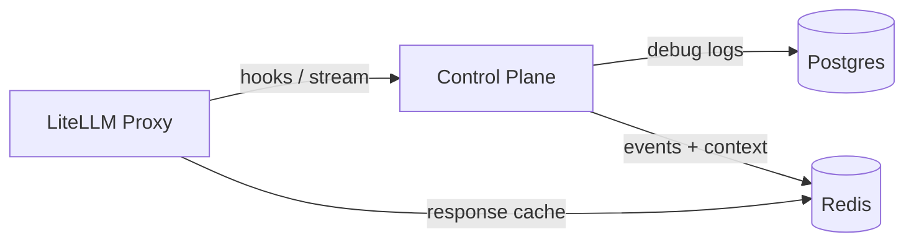

# Dataflows

## Component Overview
- LiteLLM proxy runs under `config/litellm_config.yaml` and persists request metadata through Prisma migrations before starting (`src/luthien_proxy/proxy/__main__.py:9-56`).
- Control plane FastAPI app initialises a shared asyncpg pool and Redis client in its lifespan hook; both handles are cached on `app.state` for request handlers (`src/luthien_proxy/control_plane/app.py:107-166`).
- `config/litellm_callback.py` forwards configured LiteLLM hook invocations and streaming chunks to the control plane. The control plane stores structured logs in Postgres and publishes conversation events over Redis.

## Postgres

### Connection Layout
- `DATABASE_URL` (control plane) is required; the lifespan hook builds a `db.DatabasePool` around it (`src/luthien_proxy/control_plane/app.py:126-130`).
- `LITELLM_DATABASE_URL` (proxy) is consumed by Prisma (`prisma/litellm/schema.prisma:1-8`) and populated via `uv run prisma db push` before the proxy boots (`src/luthien_proxy/proxy/__main__.py:9-56`).

### Control Plane Tables

All control-plane schema changes are managed by Prisma migrations in `prisma/control_plane/`. Docker runs `prisma migrate deploy --schema prisma/control_plane/schema.prisma` before the service starts, and `scripts/quick_start.sh` does the same for local development.

#### `debug_logs`
- Schema: `id`, `time_created`, `debug_type_identifier`, `jsonblob` with supporting indexes (`prisma/control_plane/migrations/20250214120000_init_control_plane/migration.sql:1-12`).
- Writers: `record_debug_event` inserts JSON payloads via the shared pool (`src/luthien_proxy/control_plane/debug_records.py:14-31`). The streaming WebSocket handler and generic hook route invoke that writer for both request payloads and policy-modified results (`src/luthien_proxy/control_plane/streaming_routes.py:162-305`, `src/luthien_proxy/control_plane/hooks_routes.py:95-188`).
- Readers: trace lookups, recent-call summaries, and debug browsing endpoints all read from this table using pooled connections (`src/luthien_proxy/control_plane/conversation/db.py:61-112`, `src/luthien_proxy/control_plane/hooks_routes.py:186-279`, `src/luthien_proxy/control_plane/debug_routes.py:74-173`).

- No other control-plane tables are created ahead of time; the project relies on focused Prisma migrations when a feature requires storage (`prisma/control_plane/migrations/20250214120500_remove_legacy_tables/migration.sql:1-7`).

### LiteLLM Proxy Tables
- Prisma models under `prisma/litellm/schema.prisma` describe LiteLLM’s internal schema (budgeting, auth, spend logs, health checks, managed files, guardrails, prompts, etc.). Key tables leveraged by enabled settings in `config/litellm_config.yaml` include:
  - `LiteLLM_VerificationToken`: API key metadata, budgets, permissions (`prisma/litellm/schema.prisma:193-227`).
  - `LiteLLM_ProxyModelTable` and related credential tables for configured models (`prisma/litellm/schema.prisma:33-67`).
  - `LiteLLM_SpendLogs` and `LiteLLM_ErrorLogs` capturing per-request cost and failures when `store_model_in_db` / `store_prompts_in_spend_logs` are enabled (`prisma/litellm/schema.prisma:248-296`).
  - Daily aggregation tables (`LiteLLM_DailyUserSpend`, `LiteLLM_DailyTeamSpend`, `LiteLLM_DailyTagSpend`) that LiteLLM updates during its background bookkeeping (`prisma/litellm/schema.prisma:370-436`).
- Luthien does not interact with these tables directly; LiteLLM manages all reads/writes while serving proxy traffic.

## Redis

### Client Lifecycle
- `RedisClientManager` lazily caches `redis.asyncio` clients per URL and performs an initial `PING` before storing them (`src/luthien_proxy/utils/redis_client.py:15-66`). The control plane lifespan hook loads one client and stores it on `app.state` (`src/luthien_proxy/control_plane/app.py:131-146`).

### Pub/Sub Channels
- Conversation events publish to `luthien:conversation:{call_id}` and `luthien:conversation-trace:{trace_id}` (`src/luthien_proxy/control_plane/conversation/streams.py:18-71`).
- Writers: the generic hook endpoint publishes events after a policy responds (`src/luthien_proxy/control_plane/hooks_routes.py:162-175`), and the streaming WebSocket handler pushes both per-chunk and summary events (`src/luthien_proxy/control_plane/streaming_routes.py:227-301`).
- Readers: SSE endpoints and trace streams consume those channels by holding a pub/sub subscription and emitting Server-Sent Events (`src/luthien_proxy/control_plane/conversation/streams.py:75-149`).

### Streaming Context Keys
- `StreamContextStore` persists per-call streaming state under `stream:{call_id}:text` and `stream:{call_id}:index` with a TTL (`src/luthien_proxy/control_plane/stream_context.py:23-76`).
- Writers append final chunks and increment indices as transformed output arrives (`src/luthien_proxy/control_plane/streaming_routes.py:243-305`).
- Readers fetch accumulated text when finishing a stream or when policies query historical context (`src/luthien_proxy/control_plane/stream_context.py:44-59`). Streaming routes clear these keys explicitly when a stream ends; otherwise TTL handles expiry.

### LiteLLM Response Cache
- LiteLLM maintains its own Redis cache for model responses when `cache_responses: true` is enabled (`config/litellm_config.yaml:86-88`). Luthien does not read or write those keys; cache population and eviction are handled entirely inside LiteLLM.

### Stream Rate Limiting
- Streaming endpoints enforce an in-process token-bucket limiter to avoid over-subscribing SSE feeds (`src/luthien_proxy/control_plane/dependencies.py:29-42`, `src/luthien_proxy/control_plane/hooks_routes.py:72-84`, `src/luthien_proxy/control_plane/utils/rate_limiter.py:15-63`). The limiter lives in memory on the control-plane instance.

## Data Retention
- `debug_logs` is append-only and unbounded; retention depends on external maintenance (vacuum, manual pruning).
- Redis pub/sub channels do not retain history once consumers disconnect.
- Streaming context keys expire after the configured TTL (`StreamContextStore` default 1 hour) or when the streaming routes call `clear` during teardown.
- LiteLLM response cache uses LiteLLM-managed TTLs defined in `config/litellm_config.yaml`.

## End-to-End Flow Highlights
- **Synchronous hooks:** LiteLLM calls `POST /api/hooks/{hook}`; the control plane logs the incoming payload, runs the active policy, logs the result, writes both records into `debug_logs`, and publishes derived conversation events over Redis (`config/litellm_callback.py`, `src/luthien_proxy/control_plane/hooks_routes.py:95-188`). Trace endpoints replay those events by querying `debug_logs`.
- **Streaming hooks:** LiteLLM upgrades to `/stream/{stream_id}`. Streaming routes log chunks and policy output, persist interim/final text in Redis, publish deltas to pub/sub channels, and record summary entries in `debug_logs` when the stream ends (`src/luthien_proxy/control_plane/streaming_routes.py:162-305`).
- **Observability:** UI and API consumers read conversation history either live via SSE streams or after the fact through Postgres queries against `debug_logs`.

## Diagram

