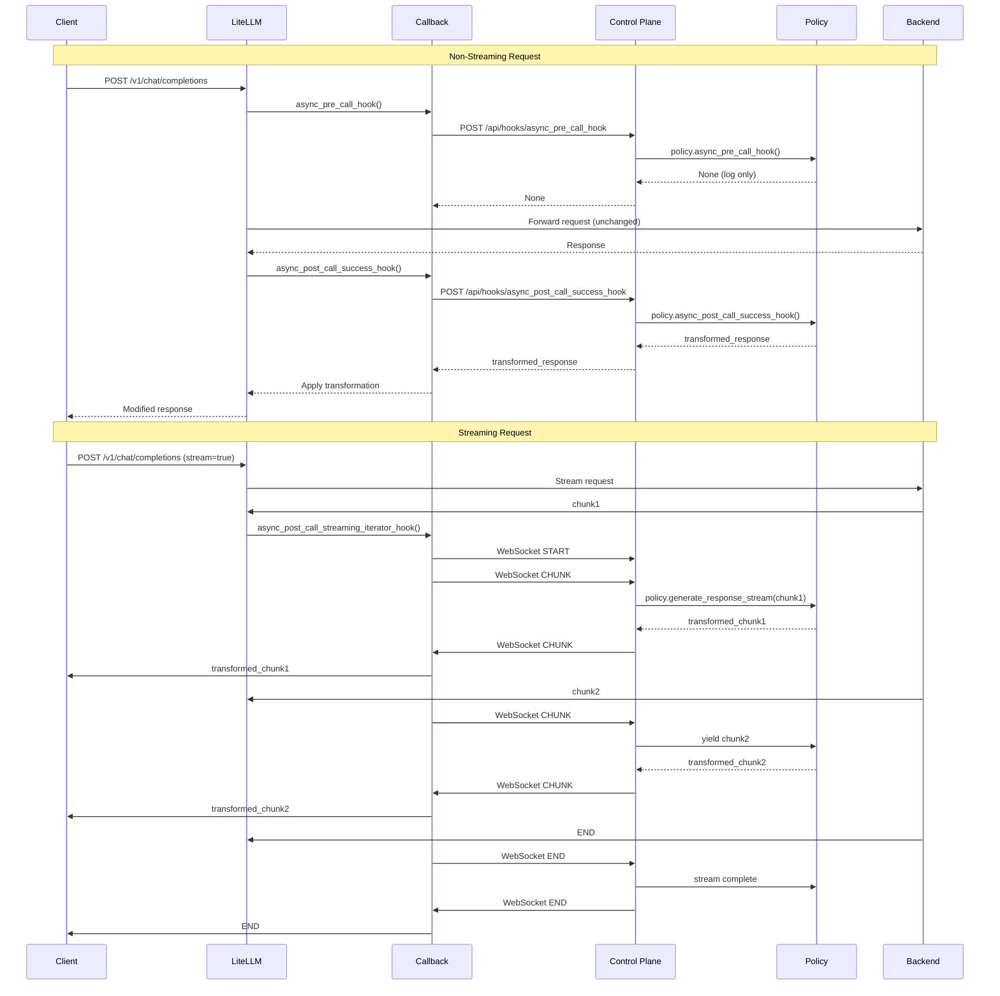

# Dataflows

## Executive Summary

Luthien intercepts LLM requests/responses via LiteLLM callbacks and forwards them to a control plane that executes **policies** (Python classes). Policies can inspect, transform, block, or augment traffic. Both original and policy-modified versions are logged to Postgres and published to Redis for monitoring.

## Architecture

```
Client → LiteLLM Proxy → Callback → Control Plane → Policy
                ↓                        ↓
            Backend (OpenAI, etc)    Postgres + Redis
```

**Components:**
- **LiteLLM proxy** (`config/litellm_config.yaml`) - Routes requests to backend providers
- **Unified callback** (`config/unified_callback.py`) - Thin forwarding layer, normalizes provider formats
- **Control plane** (FastAPI) - Executes policies, logs events, publishes to Redis
- **Policies** (`src/luthien_proxy/policies/`) - Python classes implementing control logic

## Hook Flows

### 1. Pre-Call Hook (Fire-and-Forget)

**When**: Before request sent to backend
**File**: `config/unified_callback.py:172-189`

```
Client → LiteLLM → async_pre_call_hook()
                   ↓
                   POST /api/hooks/async_pre_call_hook
                   ↓
Control Plane: log → policy.async_pre_call_hook() → log → publish Redis
               ↓
LiteLLM → Backend (request UNCHANGED - no transformation yet)
```

**Current behavior**: Fire-and-forget logging only. Return value ignored.
**TODO**: Implement request transformation (see `dev/TODO.md`).

### 2. Post-Call Success Hook (Can Transform)

**When**: After non-streaming response received
**File**: `config/unified_callback.py:210-229`

```
Backend → Response → LiteLLM
                     ↓
                     async_post_call_success_hook()
                     ↓
                     POST /api/hooks/async_post_call_success_hook
                     ↓
Control Plane: log → policy.async_post_call_success_hook() → transform → log → publish
               ↓ (returns transformed response)
LiteLLM: _apply_policy_response() mutates response in-place
         ↓
Client ← Modified Response
```

**Key**: Policy can return dict to replace response. If `None`, response unchanged.

### 3. Streaming Iterator Hook (Bidirectional WebSocket)

**When**: Streaming response
**Files**:
- Callback: `config/unified_callback.py:289-362`
- Control plane: `src/luthien_proxy/control_plane/streaming_routes.py:370-424`

#### Protocol

**Messages TO control plane:**
- `{"type": "START", "data": <request>}` - Initiate stream
- `{"type": "CHUNK", "data": <chunk>}` - Forward upstream chunk
- `{"type": "END"}` - Upstream complete

**Messages FROM control plane:**
- `{"type": "CHUNK", "data": <chunk>}` - Policy-transformed chunk
- `{"type": "KEEPALIVE"}` - Reset timeout (during long processing)
- `{"type": "END"}` - Stream complete
- `{"type": "ERROR", "error": <msg>}` - Abort

#### Flow

```
1. Backend → chunk → LiteLLM callback
2. Callback: Send {"type": "CHUNK", "data": chunk} via WebSocket
3. Control plane: chunk → policy.generate_response_stream()
4. Policy: yield transformed_chunk(s)  [0..N chunks per input]
5. Control plane: Send {"type": "CHUNK", "data": transformed}
6. Callback: Receive → normalize → yield to client
```

**Key insight**: Policy stream is **independent** of upstream - can buffer, split, drop, inject chunks.

**Example**: `ToolCallBufferPolicy` receives 5 partial chunks, buffers all, yields 1 complete chunk.

#### Provider Normalization

Callback converts Anthropic SSE → OpenAI format before control plane sees data:

```
Anthropic: event: content_block_delta\ndata: {"delta":{"text":"Hi"}}
             ↓ AnthropicToOpenAIAdapter
OpenAI:    {"choices":[{"delta":{"content":"Hi"}}]}
```

**Benefit**: Policies never see provider-specific formats.

### 4. Post-Call Failure Hook (Fire-and-Forget)

**When**: Backend error
**File**: `config/unified_callback.py:191-208`

Fire-and-forget logging only. No transformation.

## Data Storage

See [data-storage.md](data-storage.md) for detailed schema documentation.

**Summary:**

**Postgres tables:**
1. `debug_logs` - Catch-all hook payloads (legacy)
2. `conversation_calls` - Call metadata (model, status, timing)
3. `conversation_events` - Structured request/response events with sequence ordering
4. `policy_events` - Optional policy decision log (explicit calls only)

**Redis usage:**
1. **Pub/sub** - Live event stream on `luthien:conversation:{call_id}`
2. **Stream context** - Accumulate text in `stream:{call_id}:text` (TTL 1h)
3. **LiteLLM cache** - Response caching (managed by LiteLLM)

**Event format** (pub/sub):
```json
{
  "call_id": "abc-123",
  "event_type": "response",
  "sequence": 1,
  "payload": {
    "original": {"message": {"content": "Paris"}},
    "final": {"message": {"content": "[REDACTED]"}},
    "message": {"content": "[REDACTED]"}
  }
}
```

Listeners can compare `payload.original` vs `payload.final` within single event.

## Policy API

### Non-Streaming

```python
class MyPolicy(LuthienPolicy):
    async def async_pre_call_hook(self, data: dict, **kwargs) -> None:
        # Log/inspect only (return value ignored)
        pass

    async def async_post_call_success_hook(self, response: dict, **kwargs) -> dict | None:
        # Return dict to transform, None to pass through
        response["choices"][0]["message"]["content"] = "[REDACTED]"
        return response
```

### Streaming

```python
class MyStreamingPolicy(LuthienPolicy):
    def create_stream_context(self, stream_id: str, request_data: dict) -> StreamPolicyContext:
        return StreamPolicyContext(stream_id=stream_id, original_request=request_data)

    async def generate_response_stream(
        self,
        context: StreamPolicyContext,
        incoming_stream: AsyncIterator[dict],
    ) -> AsyncIterator[dict]:
        async for chunk in incoming_stream:
            # Transform, buffer, filter, etc.
            yield chunk  # Or yield transformed version
```

**Key**: No 1:1 chunk mapping required. Can yield 0..N chunks per input.

## Observability

See [observability.md](observability.md) for debugging workflows.

**Quick commands:**

```bash
# Recent calls
curl http://localhost:8081/api/hooks/recent_call_ids?limit=10

# Call snapshot
curl http://localhost:8081/api/hooks/conversation?call_id=abc-123

# Live stream (SSE)
curl -N http://localhost:8081/api/hooks/conversation/stream?call_id=abc-123

# Trace streaming pipeline
docker compose logs --no-color | grep "abc-123" | grep -E "CALLBACK|WebSocket|ENDPOINT|POLICY"
```

## Component Details

### LiteLLM Proxy
- Config: `config/litellm_config.yaml`
- Schema: `prisma/litellm/schema.prisma`
- Bootstrap: `src/luthien_proxy/proxy/__main__.py:9-56` (runs migrations before start)
- Callback: Configured as `callbacks: ["unified_callback.unified_callback"]` (line 80)

### Control Plane
- App init: `src/luthien_proxy/control_plane/app.py:107-166`
- Lifespan: Creates `app.state.db_pool` and `app.state.redis_client`
- Policy loading: From `LUTHIEN_POLICY_CONFIG` (default `config/luthien_config.yaml`)
- Schema: `prisma/control_plane/schema.prisma` (deployed via `prisma migrate deploy`)

### Hook Routes
- Generic handler: `src/luthien_proxy/control_plane/hooks_routes.py:80-173`
- Flow: log → policy → log → DB → Redis → return
- Parameter filtering: Inspects policy method signature, only passes matching params

### Streaming Routes
- WebSocket handler: `src/luthien_proxy/control_plane/streaming_routes.py:370-424`
- Event publisher: `_StreamEventPublisher` logs to `debug_logs` and publishes to Redis
- Orchestrator: `StreamOrchestrator` (`src/luthien_proxy/proxy/stream_orchestrator.py`) manages timeout and bidirectional flow

## Architectural Decisions

**Why WebSocket for streaming?**
- Bidirectional (control plane can send KEEPALIVE during long processing)
- Low latency, stateful connection matches streaming semantics
- Built-in FastAPI support

**Why normalize Anthropic to OpenAI?**
- Policies are provider-agnostic
- No provider-specific logic in control plane
- Easier to add new providers (normalization in callback only)

**Why two logging systems?**
- `debug_logs`: Legacy catch-all, easy to add without schema changes
- `conversation_events`: Structured, efficient queries, cascade deletes
- Keep both for now - `conversation_events` preferred for new code

**Why optional policy_events?**
- Not all policies make "decisions" worth logging separately
- Passthrough policies (NoOp, AllCaps) don't need decision log
- Control policies (LLMJudge, SQLProtection) benefit from structured records
- Design: Opt-in via explicit `record_policy_event()` calls

## Data Retention

**Current state**: All tables append-only, no automatic cleanup.

**Manual cleanup:**
```sql
-- Delete old debug logs (>7 days)
DELETE FROM debug_logs WHERE time_created < NOW() - INTERVAL '7 days';

-- Delete old calls and cascade events (>30 days)
DELETE FROM conversation_calls WHERE created_at < NOW() - INTERVAL '30 days';
```

**Redis TTLs:**
- Stream context: 1 hour (auto-expire)
- Pub/sub: ephemeral (no retention)
- LiteLLM cache: 5 minutes

**TODO**: Implement retention policy in control plane lifespan (see `dev/TODO.md`).

## Diagram


