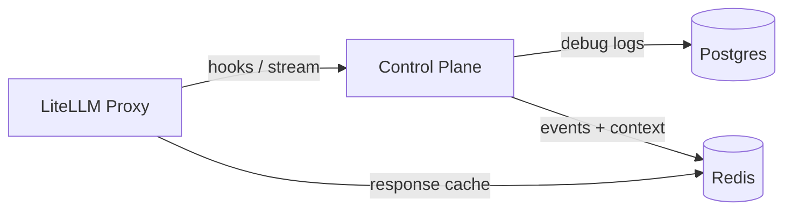

# Dataflows

## Component Overview
- LiteLLM proxy runs under `config/litellm_config.yaml` and persists request metadata through Prisma migrations before starting (`src/luthien_proxy/proxy/__main__.py:9-56`).
- Control plane FastAPI app initialises a shared asyncpg pool and Redis client in its lifespan hook; both handles are cached on `app.state` for request handlers (`src/luthien_proxy/control_plane/app.py:107-166`).
- `config/litellm_callback.py` forwards LiteLLM hooks and maintains per-call WebSocket streams with the control plane, mirroring upstream chunks, collecting policy-transformed output, and ensuring both sides tear streams down cleanly.

## Postgres

### Connection Layout
- `DATABASE_URL` (control plane) is required; the lifespan hook builds a `db.DatabasePool` around it (`src/luthien_proxy/control_plane/app.py:126-130`).
- `LITELLM_DATABASE_URL` (proxy) is consumed by Prisma (`prisma/litellm/schema.prisma:1-8`) and populated via `uv run prisma db push` before the proxy boots (`src/luthien_proxy/proxy/__main__.py:9-56`).

### Control Plane Tables

All control-plane schema changes are managed by Prisma migrations in `prisma/control_plane/`. Docker runs `prisma migrate deploy --schema prisma/control_plane/schema.prisma` before the service starts, and `scripts/quick_start.sh` does the same for local development.

#### `debug_logs`
- Schema: `id`, `time_created`, `debug_type_identifier`, `jsonblob` with supporting indexes (`prisma/control_plane/migrations/20250214120000_init_control_plane/migration.sql:1-12`).
- Writers: `record_debug_event` inserts JSON payloads via the shared pool (`src/luthien_proxy/control_plane/debug_records.py:14-31`). The streaming WebSocket handler and generic hook route invoke that writer for both request payloads and policy-modified results (`src/luthien_proxy/control_plane/streaming_routes.py:162-305`, `src/luthien_proxy/control_plane/hooks_routes.py:95-188`).
- Readers: trace lookups, recent-call summaries, and debug browsing endpoints all read from this table using pooled connections (`src/luthien_proxy/control_plane/conversation/db.py:61-112`, `src/luthien_proxy/control_plane/hooks_routes.py:186-279`, `src/luthien_proxy/control_plane/debug_routes.py:74-173`).

- No other control-plane tables are created ahead of time; the project relies on focused Prisma migrations when a feature requires storage (`prisma/control_plane/migrations/20250214120500_remove_legacy_tables/migration.sql:1-7`).

### LiteLLM Proxy Tables
- Prisma models under `prisma/litellm/schema.prisma` describe LiteLLM’s internal schema (budgeting, auth, spend logs, health checks, managed files, guardrails, prompts, etc.). Key tables leveraged by enabled settings in `config/litellm_config.yaml` include:
  - `LiteLLM_VerificationToken`: API key metadata, budgets, permissions (`prisma/litellm/schema.prisma:193-227`).
  - `LiteLLM_ProxyModelTable` and related credential tables for configured models (`prisma/litellm/schema.prisma:33-67`).
  - `LiteLLM_SpendLogs` and `LiteLLM_ErrorLogs` capturing per-request cost and failures when `store_model_in_db` / `store_prompts_in_spend_logs` are enabled (`prisma/litellm/schema.prisma:248-296`).
  - Daily aggregation tables (`LiteLLM_DailyUserSpend`, `LiteLLM_DailyTeamSpend`, `LiteLLM_DailyTagSpend`) that LiteLLM updates during its background bookkeeping (`prisma/litellm/schema.prisma:370-436`).
- Luthien does not interact with these tables directly; LiteLLM manages all reads/writes while serving proxy traffic.

## Redis

### Client Lifecycle
- `RedisClientManager` lazily caches `redis.asyncio` clients per URL and performs an initial `PING` before storing them (`src/luthien_proxy/utils/redis_client.py:15-66`). The control plane lifespan hook loads one client and stores it on `app.state` (`src/luthien_proxy/control_plane/app.py:131-146`).

### Pub/Sub Channels
- Conversation events publish to `luthien:conversation:{call_id}` and `luthien:conversation-trace:{trace_id}` (`src/luthien_proxy/control_plane/conversation/streams.py:18-71`).
- Writers: the generic hook endpoint publishes events after a policy responds (`src/luthien_proxy/control_plane/hooks_routes.py:162-175`), and the streaming WebSocket handler pushes both per-chunk and summary events (`src/luthien_proxy/control_plane/streaming_routes.py:227-301`).
- Readers: SSE endpoints and trace streams consume those channels by holding a pub/sub subscription and emitting Server-Sent Events (`src/luthien_proxy/control_plane/conversation/streams.py:75-149`).

### Streaming Context Keys
- `StreamContextStore` persists per-call streaming state under `stream:{call_id}:text` and `stream:{call_id}:index` with a TTL (`src/luthien_proxy/control_plane/stream_context.py:23-76`).
- Writers append final chunks and increment indices as transformed output arrives (`src/luthien_proxy/control_plane/streaming_routes.py:243-305`).
- Readers fetch accumulated text when finishing a stream or when policies query historical context (`src/luthien_proxy/control_plane/stream_context.py:44-59`). Streaming routes clear these keys explicitly when a stream ends; otherwise TTL handles expiry.

### LiteLLM Response Cache
- LiteLLM maintains its own Redis cache for model responses when `cache_responses: true` is enabled (`config/litellm_config.yaml:86-88`). Luthien does not read or write those keys; cache population and eviction are handled entirely inside LiteLLM.

### Stream Rate Limiting
- Streaming endpoints enforce an in-process token-bucket limiter to avoid over-subscribing SSE feeds (`src/luthien_proxy/control_plane/dependencies.py:29-42`, `src/luthien_proxy/control_plane/hooks_routes.py:72-84`, `src/luthien_proxy/control_plane/utils/rate_limiter.py:15-63`). The limiter lives in memory on the control-plane instance.

## Data Retention
- `debug_logs` is append-only and unbounded; retention depends on external maintenance (vacuum, manual pruning).
- Redis pub/sub channels do not retain history once consumers disconnect.
- Streaming context keys expire after the configured TTL (`StreamContextStore` default 1 hour) or when the streaming routes call `clear` during teardown.
- LiteLLM response cache uses LiteLLM-managed TTLs defined in `config/litellm_config.yaml`.

## Streaming Pipeline Instrumentation
The streaming pipeline has comprehensive logging at all 6 steps from backend to client:

- **Step 1 - Callback instrumentation**: The `@instrument_callback` decorator logs inputs, outputs, and yielded chunks for LiteLLM callbacks (`src/luthien_proxy/proxy/callback_instrumentation.py`). Each callback invocation is recorded with metadata, arguments, and return values; streaming callbacks additionally log each chunk yielded to the client.
- **Step 2 - WebSocket message logging (OUT)**: `WebSocketMessageLogger` logs outgoing messages (litellm → control plane) in `StreamConnection._sender_loop()` (`src/luthien_proxy/proxy/websocket_logger.py`). Logs include START, CHUNK, END, ERROR messages with type, keys, and stream ID for correlation.
- **Step 3 - Control plane endpoint logging**: `StreamingEndpointLogger` logs WebSocket messages received at the streaming endpoint and policy invocations (`src/luthien_proxy/control_plane/endpoint_logger.py`). Logs include ENDPOINT START, CHUNK IN/OUT, POLICY invocation, and END messages. All logs include stream_id for correlation.
- **Step 4 - Policy stream logging**: `PolicyStreamLogger` logs chunks received and yielded by policy processing (`src/luthien_proxy/policies/policy_instrumentation.py`). Instrumentation is applied via wrapper in `streaming_routes.py:_forward_policy_output()`, working for ALL policies. Logs include POLICY STREAM START, CHUNK IN (from backend), CHUNK OUT (to client), and STREAM END.
- **Step 5 - WebSocket message logging (IN)**: Same `WebSocketMessageLogger` logs incoming messages (control plane → litellm) in `StreamConnection._receiver_loop()`. Logs CHUNK and END messages received from control plane.
- **Step 6 - Callback chunk processing**: `CallbackChunkLogger` logs chunk processing in the callback (`src/luthien_proxy/proxy/callback_chunk_logger.py`). Integrated into `config/litellm_callback.py:poll_control()` and yield points. Logs CALLBACK CONTROL IN (messages received), NORMALIZED (validation results), and TO CLIENT (chunks yielded).
- **E2E tests**: Instrumentation is verified through E2E tests that parse docker logs (`tests/e2e_tests/test_callback_invocation.py`, `tests/e2e_tests/test_websocket_logging.py`, `tests/e2e_tests/test_endpoint_logging.py`, `tests/e2e_tests/test_policy_logging.py`, `tests/e2e_tests/test_callback_chunk_processing.py`).

### Usage Examples

**View callback invocations:**
```bash
# See all callback invocations with their inputs/outputs
docker compose logs litellm-proxy --no-color | grep "CALLBACK"

# Filter for specific callback (e.g., streaming iterator hook)
docker compose logs litellm-proxy --no-color | grep "async_post_call_streaming_iterator_hook"

# See chunks being yielded to client
docker compose logs litellm-proxy --no-color | grep "CALLBACK.*yielded"
```

**Trace WebSocket message flow:**
```bash
# See all WebSocket messages (both directions)
docker compose logs litellm-proxy --no-color | grep "WebSocket"

# Outgoing messages only (litellm → control plane)
docker compose logs litellm-proxy --no-color | grep "WebSocket OUT"

# Incoming messages only (control plane → litellm)
docker compose logs litellm-proxy --no-color | grep "WebSocket IN"

# Follow a specific stream by ID (UUID from log output)
docker compose logs litellm-proxy --no-color | grep "a1b2c3d4-5678-90ab-cdef-1234567890ab"

# See START messages to understand stream initiation
docker compose logs litellm-proxy --no-color | grep "WebSocket OUT.*type=START"
```

**Trace control plane endpoint handling:**
```bash
# See all endpoint events (control plane logs)
docker compose logs control-plane --no-color | grep "ENDPOINT"

# See when streams start
docker compose logs control-plane --no-color | grep "ENDPOINT START"

# See policy invocations
docker compose logs control-plane --no-color | grep "ENDPOINT POLICY"

# See chunks flowing through endpoint (both IN and OUT)
docker compose logs control-plane --no-color | grep "ENDPOINT CHUNK"

# See when streams complete
docker compose logs control-plane --no-color | grep "ENDPOINT END"

# Follow a specific stream through the endpoint
docker compose logs control-plane --no-color | grep "ENDPOINT.*a1b2c3d4-5678-90ab-cdef-1234567890ab"
```

**Trace policy processing:**
```bash
# See all policy events (control plane logs)
docker compose logs control-plane --no-color | grep "POLICY"

# See when policy streams start
docker compose logs control-plane --no-color | grep "POLICY STREAM START"

# See chunks received by policy (from backend)
docker compose logs control-plane --no-color | grep "POLICY CHUNK IN"

# See chunks yielded by policy (to client)
docker compose logs control-plane --no-color | grep "POLICY CHUNK OUT"

# See when policy streams complete
docker compose logs control-plane --no-color | grep "POLICY STREAM END"

# See specific policy in action (e.g., LLMJudgeToolPolicy)
docker compose logs control-plane --no-color | grep "POLICY.*LLMJudgeToolPolicy"
```

**Trace callback chunk processing:**
```bash
# See all callback chunk processing (litellm-proxy logs)
docker compose logs litellm-proxy --no-color | grep "CALLBACK"

# See messages received from control plane
docker compose logs litellm-proxy --no-color | grep "CALLBACK CONTROL IN"

# See chunk normalization results
docker compose logs litellm-proxy --no-color | grep "CALLBACK NORMALIZED"

# See chunks being sent to client
docker compose logs litellm-proxy --no-color | grep "CALLBACK TO CLIENT"

# Check for normalization failures
docker compose logs litellm-proxy --no-color | grep "CALLBACK NORMALIZED.*success=False"
```

**Debug a specific request:**
```bash
# Make a request, then immediately check recent logs
curl -X POST http://localhost:4000/v1/chat/completions \
  -H "Authorization: Bearer sk-luthien-dev-key" \
  -H "Content-Type: application/json" \
  -d '{"model": "dummy-agent", "messages": [{"role": "user", "content": "test"}], "stream": true}'

# View last 30 seconds of logs
docker compose logs litellm-proxy --since 30s --no-color | grep -E "CALLBACK|WebSocket"
```

**Correlation workflow (trace a chunk through all 6 pipeline steps):**
```bash
# 1. Find the stream ID from a recent request
docker compose logs litellm-proxy --tail 100 --no-color | grep "WebSocket OUT.*START"
# Output: WebSocket OUT [abc-123-def]: type=START, keys=[...]

# 2. Trace litellm-proxy side (Steps 1, 2, 6)
docker compose logs litellm-proxy --no-color | grep "abc-123-def"
# Shows: CALLBACK invocations, WebSocket OUT messages, WebSocket IN messages

# 3. Trace control-plane side (Steps 3, 4, 5)
docker compose logs control-plane --no-color | grep "abc-123-def"
# Shows: ENDPOINT events, POLICY events, including chunks IN and OUT

# 4. Verify end-to-end flow for specific stream
docker compose logs --no-color | grep "abc-123-def" | grep -E "CALLBACK|WebSocket|ENDPOINT|POLICY"
# Combined view showing all instrumentation points in chronological order

# 5. Count chunks at each stage
echo "Chunks sent to control plane:"
docker compose logs litellm-proxy --no-color | grep "abc-123-def.*WebSocket OUT.*type=CHUNK" | wc -l

echo "Chunks received by policy:"
docker compose logs control-plane --no-color | grep "abc-123-def.*POLICY CHUNK IN" | wc -l

echo "Chunks yielded by policy:"
docker compose logs control-plane --no-color | grep "abc-123-def.*POLICY CHUNK OUT" | wc -l

echo "Chunks received from control plane:"
docker compose logs litellm-proxy --no-color | grep "abc-123-def.*WebSocket IN.*type=CHUNK" | wc -l
```

## End-to-End Flow Highlights
- **Synchronous hooks:** LiteLLM calls `POST /api/hooks/{hook}`; the control plane logs the incoming payload, runs the active policy, logs the result, writes both records into `debug_logs`, and publishes derived conversation events over Redis (`config/litellm_callback.py`, `src/luthien_proxy/control_plane/hooks_routes.py:95-188`). Trace endpoints replay those events by querying `debug_logs`.
- **Streaming hooks:** LiteLLM streams responses to the callback. The callback's `StreamConnectionManager` establishes a control-plane WebSocket on first chunk, forwards upstream deltas as `CHUNK` messages, and polls for transformed output. Policies such as `ToolCallBufferPolicy` can buffer raw tool-call fragments, log the assembled tool call, and push a synthesized chunk back over the socket. The callback yields those transformed chunks to the client, flushes any remaining control-plane output when the model finishes, cancels the receive task, and sends a final `END` so the control plane can clean up (`config/litellm_callback.py`, `src/luthien_proxy/policies/tool_call_buffer.py`, `src/luthien_proxy/control_plane/streaming_routes.py:162-305`).
- **Observability:** UI and API consumers read conversation history either live via SSE streams or after the fact through Postgres queries against `debug_logs`. Streaming pipeline debugging uses callback instrumentation and WebSocket message logging to trace data flow from backend to client.

## Diagram

