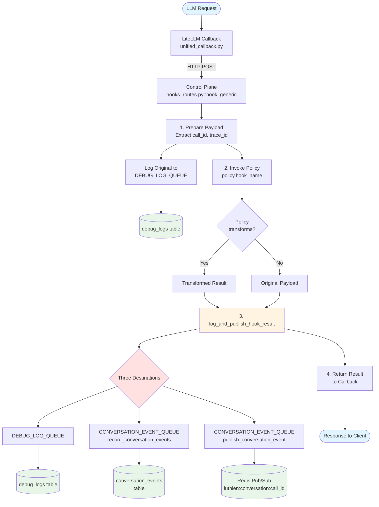
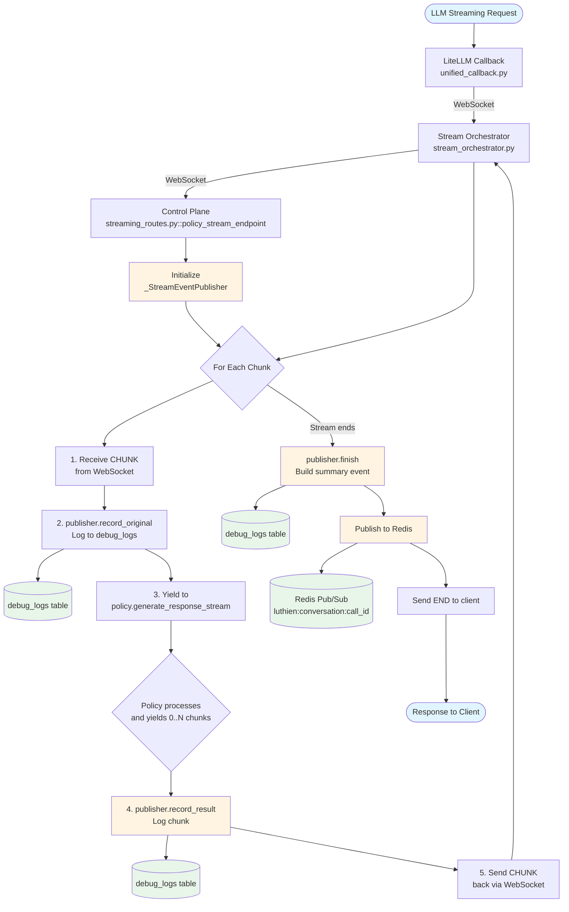
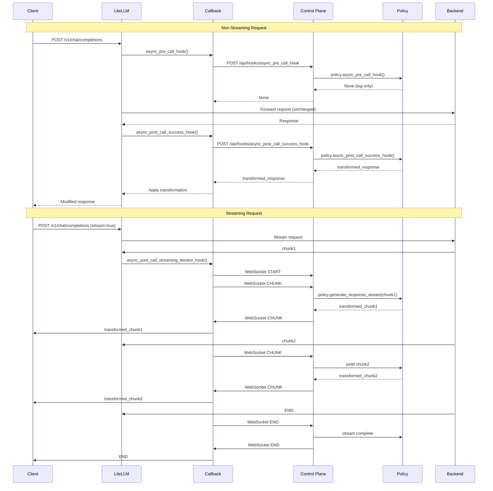
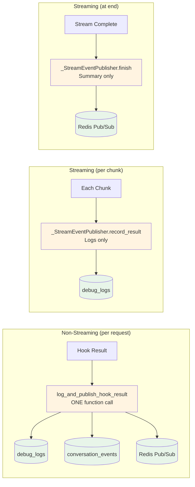
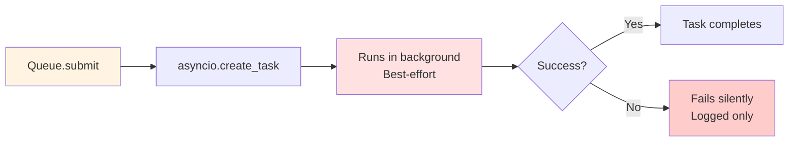
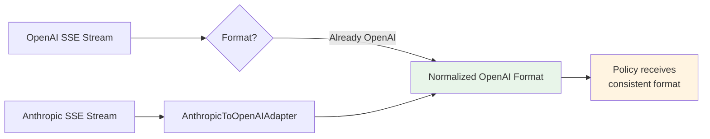

# Luthien Dataflow Diagrams

This document provides visual representations of how data flows through Luthien's proxy and control plane architecture.

## Non-Streaming Request Flow

Shows the complete journey of a standard (non-streaming) LLM request through Luthien:

### Key Components

- **Blue nodes**: Request entry and exit points
- **Yellow nodes**: Key processing functions (`log_and_publish_hook_result`)
- **Red diamonds**: Decision points and multi-destination routing
- **Green cylinders**: Persistent storage (database tables, Redis)

### Files Referenced

- `config/unified_callback.py` - LiteLLM callback that POSTs to control plane
- `src/luthien_proxy/control_plane/hooks_routes.py` - Main hook handler (`hook_generic`)
- `src/luthien_proxy/control_plane/hook_result_handler.py` - Result processing helper

---

## Streaming Request Flow

Shows how streaming LLM requests flow through Luthien, processing chunks in real-time:

### Key Differences from Non-Streaming

- **Bidirectional WebSocket**: Proxy and control plane communicate in real-time
- **Per-chunk logging only**: Each chunk is logged to `debug_logs` but NOT written to `conversation_events` (performance optimization)
- **Summary at end**: Only when the stream completes does `publisher.finish()` publish a summary event to Redis
- **Loop structure**: Process continues until stream ends
- **Publisher object**: `_StreamEventPublisher` maintains state across chunks

**Why different?** Streaming avoids write amplification - a 1000-chunk response would create 1000 database rows. Instead, we log each chunk for debugging but only publish one summary event at the end.

### Files Referenced

- `src/luthien_proxy/proxy/stream_orchestrator.py` - Manages bidirectional WebSocket communication
- `src/luthien_proxy/control_plane/streaming_routes.py` - Streaming endpoint (`policy_stream_endpoint`)
- `src/luthien_proxy/control_plane/streaming_routes.py` - `_StreamEventPublisher` class

---

## Hook Timeline (Sequence Diagram)

Shows the temporal sequence of hooks coordinating between LiteLLM, control plane, and backend:

**Key insight**: This timeline view shows call ordering that flowchart diagrams don't capture - particularly useful for understanding pre-call vs post-call hook timing.

---

## Result Handling Pattern

Non-streaming and streaming use different strategies optimized for their use cases:

### Result Handling Comparison

**Non-Streaming**: Three destinations per request
1. **`debug_logs` table** - Raw logging for debugging and auditing
2. **`conversation_events` table** - Structured events for analysis and reconstruction
3. **Redis Pub/Sub** - Real-time streaming to UI and monitoring tools

**Streaming**: Two-phase approach (performance optimization)
- **Per-chunk**: Only `debug_logs` (avoids write amplification)
- **At stream end**: Only Redis pub/sub with summary

### Architecture Comparison

| Aspect | Non-Streaming | Streaming |
|--------|---------------|-----------|
| **Processing unit** | Complete request | Individual chunk + summary |
| **Handler** | `log_and_publish_hook_result()` function | `_StreamEventPublisher.record_result()` (per chunk) `_StreamEventPublisher.finish()` (at end) |
| **When called** | Once per request | Per chunk + once at end |
| **debug_logs writes** | 1 per request | N+1 per request (N chunks + 1 summary) |
| **conversation_events writes** | 1 per request | 0 (never) |
| **Redis pub/sub** | 1 per request | 1 at stream end only |

**Key insight**: Streaming sacrifices structured event storage (conversation_events) to avoid database write amplification, while still providing debug logs for troubleshooting.

---

## Task Queue Flow

Shows how background tasks are processed:

**Important**: Both `DEBUG_LOG_QUEUE` and `CONVERSATION_EVENT_QUEUE` are **best-effort**. Failures in logging/publishing do not block the main request flow.

---

## Provider Normalization (Streaming)

Shows how different LLM provider formats are normalized:

**Files**: `src/luthien_proxy/proxy/stream_normalization.py`

---

## How to Use These Diagrams

1. **For onboarding**: Start with the result handling pattern, then explore non-streaming flow
2. **For debugging**: Follow the flow from entry point to identify where data goes
3. **For development**: Reference when adding new policies or modifying result handling
4. **For architecture review**: See the complete picture of data movement
5. **For timeline understanding**: Use sequence diagram to see hook call ordering

All diagrams use [Mermaid](https://mermaid.js.org/) syntax and render natively in:
- GitHub markdown
- GitLab markdown
- Many IDE markdown previewers
- Documentation sites (MkDocs, Docusaurus, etc.)
