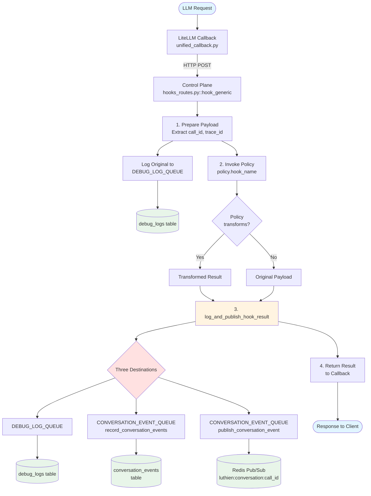
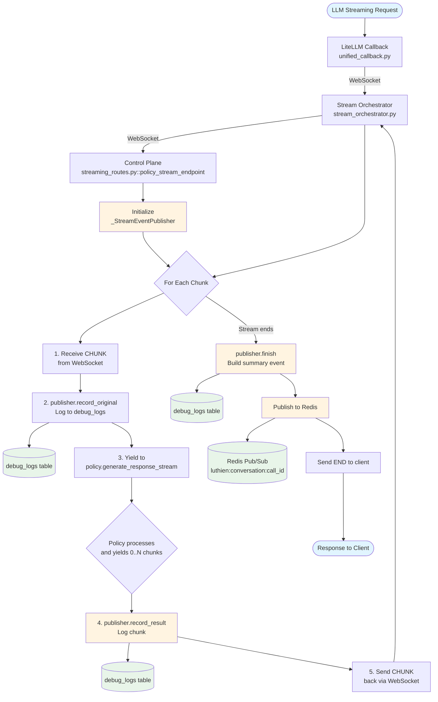
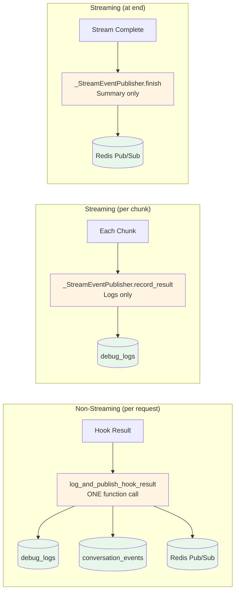

# Reading Guide: Understanding Luthien Dataflows

## Visual Overview

> **💡 Prefer standalone diagrams?** See [dataflow-diagrams.md](dataflow-diagrams.md) for full-page visualizations with detailed explanations.

Start here to understand how data flows through Luthien:

### Non-Streaming Request Flow

### Streaming Request Flow

### Result Handling: The Key Pattern

Non-streaming and streaming use different strategies optimized for their use cases:

**Key insight**: Non-streaming writes to three destinations per request. Streaming avoids write amplification by only logging chunks to debug_logs and publishing one summary event at the end.

---

## New to Luthien?

After reviewing the diagrams above, dive into the code:

1. **Architecture overview**: [docs/dataflows.md](dataflows.md)
   - Read the sequence diagram first (bottom of file)
   - Then read "Hook Flows" section

2. **Non-streaming flow**: Follow one request end-to-end
   - **Entry point**: [config/unified_callback.py:210](../config/unified_callback.py#L210) (`async_post_call_success_hook`)
     - Shows how callback POSTs to control plane
   - **Main handler**: [control_plane/hooks_routes.py:80](../src/luthien_proxy/control_plane/hooks_routes.py#L80) (`hook_generic`)
     - Read the docstring DATAFLOW section
     - Skim the function - don't trace into helpers yet
   - **Result handler**: [control_plane/hook_result_handler.py](../src/luthien_proxy/control_plane/hook_result_handler.py) (`log_and_publish_hook_result`)
     - Shows logging → database → Redis flow
   - **Stop here** on first read - you understand the full flow

3. **Streaming flow**: Follow chunks through the pipeline
   - **Entry point**: [config/unified_callback.py:289](../config/unified_callback.py#L289) (`async_post_call_streaming_iterator_hook`)
   - **Orchestrator**: [proxy/stream_orchestrator.py](../src/luthien_proxy/proxy/stream_orchestrator.py) (`StreamOrchestrator.run()`)
     - Focus on the `async for` loop - shows bidirectional flow
   - **Control plane**: [control_plane/streaming_routes.py:370](../src/luthien_proxy/control_plane/streaming_routes.py#L370) (`policy_stream_endpoint`)
     - Read docstring DATAFLOW section
     - See `_forward_policy_output()` for chunk forwarding logic

## Deep Dives

Once you understand the basic flow:

### Provider Normalization
- **File**: [proxy/stream_normalization.py](../src/luthien_proxy/proxy/stream_normalization.py) (`AnthropicToOpenAIAdapter`)
- **Why**: Converts Anthropic SSE events to OpenAI chunk format
- **Impact**: Policies never see provider-specific formats

### Database Schema
- **File**: [prisma/control_plane/schema.prisma](../prisma/control_plane/schema.prisma)
- **Events**: [conversation/events.py](../src/luthien_proxy/control_plane/conversation/events.py) (`build_conversation_events`)
- **Storage**: [conversation/store.py](../src/luthien_proxy/control_plane/conversation/store.py) (`record_conversation_events`)

### Policy API
- **Base class**: [policies/base.py](../src/luthien_proxy/policies/base.py) (`LuthienPolicy`)
- **Example**: [policies/tool_call_buffer.py](../src/luthien_proxy/policies/tool_call_buffer.py) (`ToolCallBufferPolicy`)
  - Shows streaming buffering pattern
  - Good reference for custom policies

## Common Questions

**Q: Where does the policy result go?**
A: `hooks_routes.py` → `log_and_publish_hook_result()` → 3 destinations:
   1. `debug_logs` table (via `DEBUG_LOG_QUEUE`)
   2. `conversation_events` table (via `CONVERSATION_EVENT_QUEUE`)
   3. Redis pub/sub channel `luthien:conversation:{call_id}`

**Q: How are streaming chunks forwarded?**
A: Bidirectional WebSocket between callback and control plane:
   - Callback → control plane: `{"type": "CHUNK", "data": <upstream>}`
   - Control plane → callback: `{"type": "CHUNK", "data": <policy_transformed>}`
   - See [stream_orchestrator.py:run()](../src/luthien_proxy/proxy/stream_orchestrator.py) for orchestration logic

**Q: What gets logged?**
A: Every line with `DEBUG_LOG_QUEUE` or `CONVERSATION_EVENT_QUEUE`
   - Original payloads: `f"hook:{hook_name}"`
   - Results: `f"hook_result:{hook_name}"`
   - Search codebase for `DEBUG_LOG_QUEUE.submit` to find all log points

**Q: How do I test my changes?**
A: Three levels:
   1. Unit tests: `uv run pytest tests/unit_tests`
   2. Integration: `uv run pytest tests/integration_tests`
   3. E2E (slow): `uv run pytest -m e2e`

**Q: How do I trace a live request?**
A: See [observability.md](observability.md) for docker log commands
   - Quick: `docker compose logs --no-color | grep "{call_id}"`

## Streaming Result Handling

Streaming uses a different approach than non-streaming, optimized to avoid write amplification:

**Non-streaming**: Uses the `log_and_publish_hook_result()` helper function (in [hook_result_handler.py](../src/luthien_proxy/control_plane/hook_result_handler.py))
- Called once after policy processes the complete request
- Logs to debug_logs, records to conversation_events, publishes to Redis
- Three destinations per request

**Streaming**: Uses the `_StreamEventPublisher` class (in [streaming_routes.py](../src/luthien_proxy/control_plane/streaming_routes.py))
- Created once per streaming session
- **Per-chunk**: Only logs to debug_logs (via `record_result()`)
- **At stream end**: Logs summary to debug_logs + publishes to Redis (via `finish()`)
- **Never writes to conversation_events** (avoids database write amplification)

The approaches differ intentionally: streaming sacrifices structured event storage to avoid creating N database rows for N-chunk responses.

## Data Structures

Understanding the shape of data at each step:

**Hook Payloads**:
- Non-streaming hooks receive the full LiteLLM callback payload
- See [LiteLLM callback documentation](https://docs.litellm.ai/docs/observability/custom_callback) for exact schemas
- Key fields: `litellm_call_id`, `litellm_trace_id`, `messages`, `model`, `response`, etc.

**Conversation Events** ([conversation/events.py](../src/luthien_proxy/control_plane/conversation/events.py)):
- `ConversationEvent` - stored in database and published to Redis
- Built from hook payloads by `build_conversation_events()`
- Fields: `call_id`, `trace_id`, `event_type`, `timestamp`, `payload`, etc.
- See [schema.prisma](../prisma/control_plane/schema.prisma) for database schema

**Streaming Chunks**:
- OpenAI format: `{"choices": [{"delta": {...}, "index": 0}], "model": "...", ...}`
- Anthropic chunks normalized to OpenAI format via `AnthropicToOpenAIAdapter`
- See [proxy/stream_normalization.py](../src/luthien_proxy/proxy/stream_normalization.py) for normalization logic

**WebSocket Messages** ([proxy/stream_orchestrator.py](../src/luthien_proxy/proxy/stream_orchestrator.py)):
- `{"type": "CHUNK", "data": <chunk>}` - streaming chunk from upstream or policy
- `{"type": "DONE"}` - end of stream signal
- `{"type": "ERROR", "error": <message>}` - error occurred during streaming
