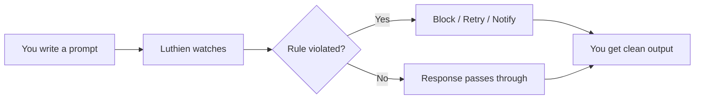

<div align="center">

# Luthien

### Let AI code. Stay in control.

The drop-in proxy for AI coding agents.
See every request, enforce every rule, without changing your code.

<!-- TODO: Replace with actual screenshot/GIF -->


**Two env vars. That's it.**

```bash
export ANTHROPIC_BASE_URL=http://localhost:8000/v1
export ANTHROPIC_API_KEY=sk-luthien-dev-key
```

[Get Started](#quick-start) | [View Policies](#write-your-own-policy) | [See It Work](#see-it-work)

</div>

---

## See it work

<!-- TODO: Replace placeholders with actual screenshots -->

<table>
<tr>
<td width="50%">

### Before Luthien


Claude refactors files you didn't ask it to touch. The diff is unreviewable.

</td>
<td width="50%">

### After Luthien


Luthien catches scope creep, blocks dangerous ops, retries safely. You get a clean diff.

</td>
</tr>
</table>

---

## How it works



<table>
<tr>
<td align="center" width="20%">

**1. Configure**

Toggle rules in the dashboard or write Python policies

</td>
<td align="center" width="5%">

→

</td>
<td align="center" width="20%">

**2. Code**

Use Claude Code as normal. Luthien is invisible until needed.

</td>
<td align="center" width="5%">

→

</td>
<td align="center" width="20%">

**3. Enforce**

Policies run on every request/response in real-time

</td>
<td align="center" width="5%">

→

</td>
<td align="center" width="20%">

**4. Review**

See what got blocked, retried, or flagged

</td>
</tr>
</table>

---

## What Luthien catches

<table>
<tr>
<td width="33%">

### Dangerous commands
```
✗ rm -rf dist/
✗ git push --force origin main
✗ DROP TABLE users
```

Blocked before they execute.

</td>
<td width="33%">

### Scope creep
```
✗ Edit src/utils/helpers.js
  (not in scope)
✗ Add feature outside spec
✗ Reorganize imports
```

Caught and retried with corrections.

</td>
<td width="33%">

### AI slop
```
— → -    (em dashes)
" " → " "  (curly quotes)
' ' → ' '  (fancy apostrophes)
```

Cleaned automatically on every response.

</td>
</tr>
</table>

> *"The M dash thing will actually work... I want another brain in there."* — Finn, Seldon Labs ($20/mo for this)

---

## Write your own policy

**Simple text replacement:**
```python
class DeSlop(SimplePolicy):
    def simple_on_response_content(self, content, context):
        return content.replace("\u2014", "-")  # em dash → dash
```

**LLM-powered rule enforcement:**
```python
class SafetyPolicy(SimpleJudgePolicy):
    RULES = [
        "Never allow 'rm -rf' commands",
        "Block requests to delete production data",
        "Require approval for git push --force"
    ]
```

**That's it.** Restart the gateway and your policy is live.

---

## Quick start

```bash
git clone https://github.com/LuthienResearch/luthien-proxy
cd luthien-proxy
cp .env.example .env        # Add your ANTHROPIC_API_KEY
docker compose up -d
```

Then point your agent at Luthien:

```bash
export ANTHROPIC_BASE_URL=http://localhost:8000/v1
claude
```

**Open the dashboard:** [localhost:8000/activity/monitor](http://localhost:8000/activity/monitor)

<!-- TODO: Replace with actual dashboard screenshot -->
<p align="center">

</p>

---

## What you get

| | |
|---|---|
| **Gateway** | OpenAI + Anthropic compatible proxy at `:8000` |
| **Dashboard** | Real-time activity monitor + policy config UI |
| **Policies** | Python classes that hook into every request/response |
| **History** | Searchable conversation logs across sessions |
| **Streaming** | Full streaming support for Claude Code |

---

<div align="center">

Built by [Luthien Research](https://luthienresearch.org) · Open source · [Apache 2.0](LICENSE)

*"If I have to break my workflow, the friction is a lot higher."* — Jack, Counterweight AI

</div>
